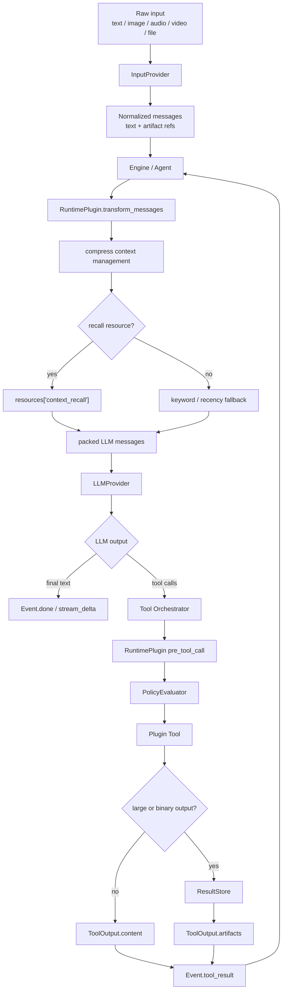
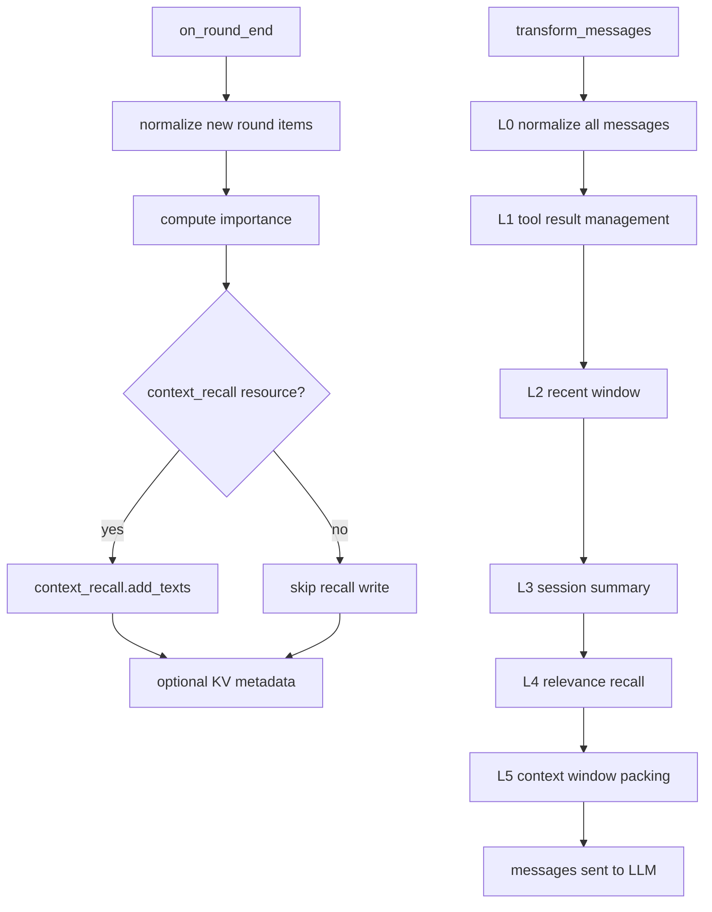

# Engine Boundary Design

## 定位

本文档记录新版引擎边界，以及与上下文治理相关的配套改动。它不只是 `compress` 插件方案，也包含 `InputProvider`、共享资源容器、模型入口、插件边界、artifact 输出等设计。

引擎定位：

```text
Engine
  -> 读取 Agent YAML
  -> 调用 LLMProvider
  -> 运行 ReAct / POR
  -> 编排工具和插件 hook
  -> 输出事件流和结果
```

引擎不直接处理业务协议、向量化、OCR、ASR、视频分析、图片生成、视频生成、文档解析。这些属于 `InputProvider`、插件或共享资源。

## 开发硬约束

后续开发必须按本文档收敛边界。没有上下文的 AI 也按下面规则执行。

必须遵守：

- 不新增 `ToolProvider` 抽象。
- 不把 embedding、vector store、OCR、ASR、视频解析、图片生成、视频生成做成 Engine 专用参数。
- 不把业务系统、内部 API、私有鉴权、服务发现写进开源引擎。
- 不把 `InputProvider` 做成 Runtime Plugin。
- 不让 `compress` 计算费用预算，也不替代 `cost_control`。
- 不迁移微服务 DB 模型，不依赖 SQLAlchemy。
- 每次实现尽量不超过 4 个文件；大改按阶段拆。
- 保持小函数、小模块，单个函数目标不超过 50 行。

优先级：

```text
1. 边界清晰
2. 代码少
3. 抽象稳定
4. 可测试
5. 可扩展
```

## 推荐 Engine 接线

```python
engine = Engine(
	default_llm=default_llm,
	fallback_llm=fallback_llm,
	utility_llm=utility_llm,
	input_provider=input_provider,
	result_store=result_store,
	command_executor=command_executor,
	policy_evaluator=policy_evaluator,
	resources={
		"context_recall": context_recall_resource,
		"knowledge_index": knowledge_index_resource,
	},
)
```

目标公开构造面：

```text
default_llm       必填，主 LLMProvider
fallback_llm      可选，主模型失败兜底
utility_llm       可选，摘要/观察/重规划等辅助任务
input_provider    可选，原始输入预处理；默认 passthrough
result_store      可选，大结果和 artifact 存储
command_executor  可选，命令类工具统一执行出口
policy_evaluator  可选，工具执行策略裁决
resources         可选，通用共享资源注册表
```

Engine 不应因为某个插件需要资源就继续膨胀构造函数。多个插件共享的外部依赖统一放 `resources`。

模型相关入口：

```text
default_llm
  主推理模型，负责 ReAct / POR / 工具调用决策。

fallback_llm
  可选，主模型失败时兜底。

utility_llm
  可选，摘要、观察、重规划、反思、格式修复等杂活。
```

不进入 Engine 专用参数的模型：

```text
embedding model
vision model
OCR / ASR model
video understanding model
image generation model
video generation model
TTS model
```

它们属于 `InputProvider`、插件或共享资源。

## 插件边界

Runtime Plugin 是 Agent 执行期扩展点：

```text
inject_context
transform_messages
pre_llm_call
pre_tool_call
post_tool_call
on_round_end
get_tools
```

工具扩展契约是：

```text
BasePlugin.get_tools()
  -> ToolDefinition
  -> ToolOutput
```

不新增单独 `ToolProvider` 层。插件自己如何连接外部系统、如何发现私有工具、如何鉴权，属于插件自己的协议，不进入 Engine core。

## InputProvider 边界

`InputProvider` 是 Agent 主循环之前的输入收口。它不是 Runtime Plugin。

```text
Raw input
  -> InputProvider
  -> normalized messages
  -> Engine
```

它负责把原始文本、图片、音频、视频、文件等输入转成引擎可执行的标准消息和 artifact 引用。未传 `InputProvider` 时，默认 passthrough。

```python
class InputProviderResult:
	messages: list[dict]
	artifacts: list[object]
	metadata: dict

class InputProvider:
	async def process(self, messages: list[dict], context: dict) -> InputProviderResult: ...
```

多模态处理模型不进入 Engine：

```text
image caption / OCR
audio ASR
video summary
document parser
media storage
```

这些由 `InputProvider` 自己组合。

落地要求：

```text
axc_agent_engine/input.py
  InputProviderResult
  InputProvider Protocol
  PassthroughInputProvider
```

`Agent.chat()` / `Agent.stream()` 的字符串入口继续可用；内部应先转成标准 messages，再交给 `InputProvider`。`chat_with_messages()` / `stream_with_messages()` 也要走同一条输入收口，避免两套路径。

## 输出与 Artifact 边界

文本输出由 Engine 事件流和最终结果直接输出：

```text
stream_delta
done
error
```

非文本生成输出由插件工具产生：

```text
image_generate
video_generate
text_to_speech
file_write
document_export
```

插件工具返回 `ToolOutput`，大结果和二进制文件写入 `ResultStore`，上下文中只保留 `ArtifactRef`。

```text
Plugin Tool
  -> ResultStore.put()
  -> ToolOutput(content, artifacts=[ArtifactRef(...)]
  -> Event.tool_result
```

## 总数据流



## 上下文治理定位

`compress` 插件升级为完整上下文治理插件。它不负责费用预算，不替代 `cost_control`，只负责本次 LLM 输入消息的质量和长度控制。

核心边界：

```text
cost_control
  -> 统计 token / cost
  -> 判断任务是否继续执行

compress
  -> 管理进入 LLM 的 messages
  -> 压缩工具结果
  -> 摘要长会话
  -> 召回相关历史
  -> 控制本次输入不超过上下文窗口
```

## 共享资源边界

`LLMProvider` 只负责 `chat / stream / ask`。向量化、向量库、OCR、ASR、视频解析等不进入 Engine core，也不作为 `Engine.__init__()` 的专用参数。

Engine 只提供一个通用资源容器，插件按资源名取自己需要的依赖：

```python
class ResourceRegistry:
	def __init__(self, initial: dict[str, object] | None = None) -> None: ...
	def register(self, name: str, resource: object, *, replace: bool = False) -> None: ...
	def get(self, name: str, expected_type: type | None = None) -> object | None: ...
	def require(self, name: str, expected_type: type | None = None) -> object: ...
	def names(self) -> tuple[str, ...]: ...
	def as_dict(self) -> dict[str, object]: ...
```

`PluginContext` 增加：

```python
resources: ResourceRegistry
```

落地要求：

```text
axc_agent_engine/resources.py
  ResourceRegistry
  ResourceError
  ResourceNotFoundError
  ResourceTypeError
  DuplicateResourceError
```

规则：

- `ResourceRegistry` 只保存对象，不理解对象语义。
- `Engine(resources=...)` 接收 `dict[str, object] | ResourceRegistry | None`，内部统一转成 `ResourceRegistry`。
- `PluginContext.resources` 永远有值；未传时是空 registry。
- `register()` 默认不覆盖同名资源，重复注册抛 `DuplicateResourceError`。
- 需要覆盖时必须显式 `replace=True`。
- `get()` 找不到返回 `None`。
- `require()` 找不到直接抛错。
- `expected_type` 只做轻量 `isinstance` 校验。
- `names()` 返回稳定排序后的资源名，便于调试。
- `as_dict()` 返回浅拷贝，禁止外部直接改内部 dict。
- 插件读取资源名来自自己的 YAML 配置。
- `ResourceRegistry` 不负责生命周期管理，不自动 close 外部资源。
- 资源对象由宿主应用创建和关闭，除非后续显式设计资源生命周期协议。

禁止事项：

- 不做 service locator 大框架。
- 不做自动 import。
- 不做基于字符串的类实例化。
- 不做资源依赖图。
- 不做 lazy factory。
- 不把资源名写死在 Engine core。

使用示例：

```python
resources = ResourceRegistry({
	"context_recall": context_recall_resource,
	"knowledge_index": knowledge_index_resource,
})

engine = Engine(default_llm=default_llm, resources=resources)
```

插件读取：

```python
recall_name = config.get("recall", {}).get("resource", "")
recall = plugin_ctx.resources.get(recall_name) if recall_name else None
```

`compress` 插件不关心 embedding 模型和向量数据库怎么创建，只引用资源：

```yaml
plugins:
  compress:
    enabled: true
    recall:
      enabled: true
      resource: "context_recall"
```

`context_recall` 可以是任意对象，只要私有插件或上下文治理插件约定它支持自己的方法，例如：

```python
class ContextRecallResource(Protocol):
	async def add_texts(self, texts: list[str], metadata: list[dict]) -> None: ...
	async def search(self, query: str, top_k: int = 8) -> list[dict]: ...
```

如果未配置 recall resource，L4 自动降级为关键词/近因召回，插件不能失败。

## 分层流程

```text
Raw Messages
  -> L0 Normalize
  -> L1 Tool Result Management
  -> L2 Recent Window
  -> L3 Session Summary
  -> L4 Relevance Recall
  -> L5 Context Window Packing
  -> LLM Messages
```

### L0 Normalize

标准化消息，不做压缩。

职责：
- 清理空消息和无效 tool result。
- 补充 `round`、`token_estimate`、`role`、`tool_name`、`created_at`。
- 保证 tool call 和 tool result 后续可以成对处理。

### L1 Tool Result Management

治理工具结果，避免工具输出撑爆上下文。

规则：
- 小结果原样保留。
- 中等结果使用 `ToolOutput.compact_view()`。
- 大结果写入 `ResultStore`，上下文只保留摘要和 artifact id。

输出示例：

```text
[tool result compacted]
summary: agent 微服务包含 executor、systems、routers、services、simulation。
artifact_id: artifact_agent_readme_002
```

### L2 Recent Window

保留最近 N 轮完整上下文。

必须保留：
- system prompt
- 当前用户消息
- 最近 N 轮 user / assistant / tool
- 未闭合的 tool call / tool result 对

### L3 Session Summary

对较老历史生成结构化摘要。

摘要结构：

```text
User goals:
- ...

Decisions made:
- ...

Facts discovered:
- ...

Files/artifacts touched:
- ...

Open tasks:
- ...

Constraints:
- ...
```

摘要由 `utility_llm` 生成。失败时熔断并降级，不影响主流程。

### L4 Relevance Recall

基于当前用户问题召回相关历史。

写入侧在 `on_round_end()`：

```text
本轮 user / assistant / compacted tool text
  -> importance scoring
  -> context_recall.add_texts(texts, metadata)
```

读取侧在 `transform_messages()`：

```text
current_message
  -> context_recall.search(current_message)
  -> relevance scoring
  -> recall full/compressed history
```

最终分数：

```text
score =
  semantic_score   * relevance_weight
+ recency_score    * recency_weight
+ importance_score * importance_weight
+ pinned_score     * pin_weight
```

降级：

```text
context_recall resource 存在:
  使用资源提供的召回能力

否则:
  使用关键词重叠 + 近因 + importance

再失败:
  只使用 summary + recent window
```

### L5 Context Window Packing

控制本次 LLM 输入消息不超过上下文窗口。它不是预算控制，不计算费用。

输入：
- system prompt
- session summary
- relevance recall
- recent window
- current user message

优先级：

```text
1. system prompt
2. safety / policy context
3. current user message
4. recent full rounds
5. session summary
6. recalled full messages
7. recalled compressed messages
8. placeholders
```

约束：
- 不超过 `max_input_tokens`。
- 预留 `reserve_output_tokens`。
- tool call 和 tool result 不拆散。
- 消息顺序尽量保持时间顺序。
- 被压缩内容留下明确边界。

## 推荐 YAML

```yaml
plugins:
  compress:
    enabled: true

    context_window:
      max_input_tokens: 24000
      reserve_output_tokens: 4000

    tool_result:
      max_inline_tokens: 1200
      artifact_threshold_tokens: 4000

    recent_window:
      rounds: 4

    summary:
      enabled: true
      after_rounds: 8
      keep_recent_rounds: 3
      max_tokens: 800
      max_failures: 3

    recall:
      enabled: true
      resource: "context_recall"
      top_k: 12
      token_limit: 4000
      full_threshold: 0.72
      compressed_threshold: 0.35
      relevance_weight: 0.45
      recency_weight: 0.25
      importance_weight: 0.25
      pin_weight: 0.05
```

## 推荐模块拆分

```text
axc_agent_engine/plugins/builtin/context/
  plugin.py              # CompressPlugin / ContextManagementPlugin
  normalizer.py          # L0
  tool_result.py         # L1
  recent_window.py       # L2
  summarizer.py          # L3
  recall.py              # L4
  packer.py              # L5
  scoring.py             # recency / importance / keyword score
  models.py              # ContextItem / ContextSummary / PackedContext
```

为了不破坏用户认知，插件名可以继续叫 `compress`，但内部实现按 `context` 子模块组织。

实现原则：

- 旧 `compress.py` 不继续堆大函数；新增子模块承载 L0-L5。
- `CompressPlugin` 只做配置读取、生命周期 hook、调用编排。
- L1 使用 `ToolOutput.compact_view()` 和 `ResultStore`，不直接解析业务工具结果。
- L3 只用 `utility_llm`，失败熔断。
- L4 只通过 `resources[recall.resource]` 调用召回资源；没有资源就降级。
- L5 只管上下文窗口，不管费用预算。
- 所有层都必须 fail-open：压缩失败返回原消息或降级结果，不中断主流程。

## 执行时序



## 非目标

- 不迁移微服务 DB 模型。
- 不依赖 SQLAlchemy。
- 不感知业务协议。
- 不计算费用预算。
- 不替代 `cost_control`。
- 不把向量化、向量库、OCR、ASR、视频解析做成 Engine core 参数。
- 不把向量模型塞进 `LLMProvider`。
- 不支持旧微服务 YAML 适配层；引擎就是新版标准。
- 不在 README 里引用本文档；README 只保留最终用户视角的最新描述。

## 分阶段开发建议

按以下顺序实现，避免一次性大改。

### Phase 1：基础边界

目标：

- 新增 `ResourceRegistry`。
- 新增 `InputProvider` / `PassthroughInputProvider`。
- Engine 保存 `resources` 和 `input_provider`。
- `PluginContext` 暴露 `resources`。

验收：

- 未传 `input_provider` 时现有文本 chat/stream 行为不变。
- 插件可以通过 `plugin_ctx.resources.get()` 读取共享资源。
- Engine 没有新增 embedding/vector/OCR/ASR/video 专用参数。

### Phase 2：输入收口

目标：

- 字符串输入和 messages 输入统一经过 `InputProvider`。
- `InputProviderResult.artifacts` 能进入事件 metadata 或执行上下文 metadata。

验收：

- `agent.chat("hello")` 仍可用。
- `agent.chat_with_messages([...])` 与 `agent.chat()` 走同一条输入处理路径。
- Passthrough 不改变原消息。

### Phase 3：上下文治理插件重构

目标：

- `compress` 内部拆成 context 子模块。
- 实现 L0-L5。
- recall 只通过 `resources` 引用外部资源。

验收：

- 没有 recall resource 时测试仍通过。
- 有 mock recall resource 时能写入和召回。
- 压缩失败不导致 Agent 执行失败。

### Phase 4：文档收敛

目标：

- README 中英文只保留最终用户需要的配置和流程。
- 本设计文档用于开发完成前指导实现，完成后可删除。

验收：

- README 不出现临时设计讨论。
- README 不暴露业务协议。
- README 中英文语义一致。

## 成功标准

- 长会话不会因为工具结果或历史消息撑爆上下文。
- 没有向量能力时仍能稳定运行。
- 有向量能力时能召回相关历史。
- 压缩失败不影响主流程。
- 所有外部依赖都通过协议注入。
- 插件边界清晰，适合开源。

## 最终验收命令

```bash
.venv/bin/ruff check .
.venv/bin/mypy axc_agent_engine
.venv/bin/pytest -q
find axc_agent_engine -type f -name '*.py' -not -path '*/__pycache__/*' -print | xargs .venv/bin/python -m py_compile
```
