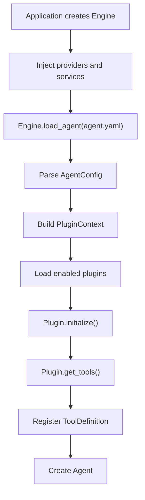
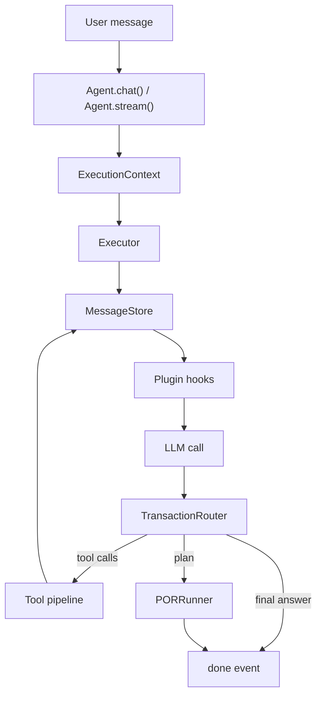

<h1 align="center">AxcAgentEngine</h1>

<p align="center">
  <b>Agent execution engine with Plan-Observe-Replan, tool calling, and a plugin system</b>
</p>

<p align="center">
  
  
  
</p>

<p align="center">
  <a href="#-quick-start">Quick Start</a> &middot;
  <a href="#-features">Features</a> &middot;
  <a href="docs/ARCHITECTURE.md">Architecture</a> &middot;
  <a href="docs/PLUGIN_DEVELOPMENT.md">Plugins</a> &middot;
  <a href="examples/README.md">Examples</a>
</p>

<p align="center">
  <a href="README.zh-CN.md">&#x1F1E8;&#x1F1F3; Chinese</a>
</p>

---

Most agent frameworks rely on a ReAct loop: think, call a tool, observe, repeat. As tasks grow more complex, plain ReAct tends to drift.

AxcAgentEngine adds **POR (Plan-Observe-Replan)** on top of ReAct: the agent produces a structured plan, schedules steps by dependency, observes outcomes, and replans when needed.

## 🚀 Quick Start

```bash
pip install axc-agent-engine
```


```python
from axc_agent_engine import Engine, LLMConfig, PluginRegistry
from axc_agent_engine.plugins.builtin import BuiltinToolsPlugin

registry = PluginRegistry()
registry.register(BuiltinToolsPlugin)

engine = Engine(
    default_llm=LLMConfig(
        base_url="https://api.openai.com/v1",
        api_key="sk-xxx",
        model="gpt-4o",
    ),
    plugin_registry=registry,
)

agent = engine.load_agent("./agents/my_agent.yaml")

# Non-streaming
result = await agent.chat("Analyze last month's sales data")

# Streaming
async for event in agent.stream("Build a REST API for user management"):
    if event.type == "stream_delta":
        print(event.content, end="")
    elif event.type == "tool_call":
        print(f"\n[Tool: {event.tool_name}]")
    elif event.type == "plan_created":
        print(f"\n[Plan: {event.content}, {len(event.steps)} steps]")
```

## ✨ Features

- **POR planning** - structured plans, dependency scheduling, replanning; routes via `auto` / `react_only` / `por_first`
- **ReAct executor** - standard think / call / observe loop
- **Plugin system** - built-in spec registry, YAML-driven loading; optional capabilities live in plugins
- **Tool protocol** - every tool returns `ToolOutput`; read-only runs concurrent, write serial; safe function-name mapping
- **Durable recovery** - `CheckpointStore` + `ExecutionRecoveryService` + Agent resume API
- **OpenAI compatible** - provider protocol + OpenAI-compatible HTTP client and API subset
- **Memory & knowledge** - four-layer memory (KV, dedup, decay, graph hooks) + semantic chunking + vector/BM25 hybrid retrieval
- **MCP** - stdio, JSON-RPC HTTP, official SDK transports
- **Human-in-the-loop** - approval queue and `ask_human` tool
- **Sidecar suite** - multi-agent, simulation, eval, cost, failure mining, trace distillation

<details>
<summary>Full capability matrix</summary>

| Capability | Implementation |
| --- | --- |
| ReAct loop | `Executor` |
| POR planning | `auto` / `react_only` / `por_first` |
| Durable recovery | `CheckpointStore` + `ExecutionRecoveryService` + Agent resume |
| Plugin system | spec registry + YAML-driven loading |
| LLM provider | provider protocol + OpenAI-compatible HTTP |
| Parallel tools | read concurrent, write serial |
| Tool output | enforced `ToolOutput` |
| Tool name compat | provider-side model-safe mapping |
| Context compression | built-in `compress` plugin |
| Memory | four layers + KV fallback + dedup + decay + graph hooks |
| Knowledge | semantic chunking + embeddings + BM25/vector + optional rerank |
| MCP | stdio / JSON-RPC HTTP / official SDK |
| Human approval | approval queue + `ask_human` |
| Sidecar | multi-agent / simulation / eval / cost / failure mining / distillation |
| API server | OpenAI Chat Completions compatible subset |

</details>

## 📦 Docs

| | |
| --- | --- |
| [Architecture](docs/ARCHITECTURE.md) | Engine and plugin boundaries |
| [API compatibility](docs/API.md) | HTTP API subset notes |
| [Plugin development](docs/PLUGIN_DEVELOPMENT.md) | Build your own plugin |
| [Security model](docs/SECURITY_MODEL.md) | Capabilities, risk, workspace |
| [Examples](examples/README.md) | 7 end-to-end demos |
| [Contributing](CONTRIBUTING.md) / [Security](SECURITY.md) / [Changelog](CHANGELOG.md) / [LICENSE](LICENSE) | Apache-2.0 |

## Agent YAML

```yaml
name: "data-analyst"
description: "Data analysis assistant"

runtime:
  max_rounds: 50
  thinking: "auto"
  workspace: "/tmp/agent-workspace"
  allowed_capabilities:
    - "file_read"
    - "file_write"
    - "http_request"

system_prompt: |
  You are a data analysis assistant...

plugins:
  builtin_tools:
    enabled: true
    load: ["get_time", "file_read", "file_write", "http_request", "result_read"]
    defer: ["file_write", "http_request"]

  knowledge:
    enabled: true
    sources: ["./docs"]
    namespace: "default"
    embedding:
      base_url: "https://api.openai.com/v1"
      api_key: "sk-xxx"
      model: "text-embedding-3-small"

  memory:
    enabled: true
    namespace: "default"
    scope_keys: ["tenant_id", "user_id", "agent_name"]
    sensitive_policy: "redact"

  compress:
    enabled: true
    summary_after_rounds: 8

  risk_guard:
    enabled: true
```

Notes:

- Plugin registration is explicit host code via `PluginRegistry`. Agent YAML only enables and configures already-registered plugins.
- `builtin_tools` loads only `get_time` when `load` is omitted; other built-ins must be explicitly enabled.
- Tools with a non-empty capability are denied by default; list them in `runtime.allowed_capabilities`.
- File and command tools require `runtime.workspace` by default.
- LLM configuration is provided in code, not in Agent YAML.

## Provider Configuration

`Engine` accepts an `LLMConfig` or any object implementing the full `LLMProvider` protocol (`model`, `tool_name_mapping`, `chat`, `stream`, `ask`, `close`).

```python
from axc_agent_engine import ConcurrencyConfig, Engine, LLMConfig
from axc_agent_engine.tools.name_mapping import ToolNameMappingConfig

default_llm = LLMConfig(
    base_url="https://api.openai.com/v1",
    api_key="sk-xxx",
    model="gpt-4o",
    timeout=120,
    max_concurrent_requests=32,
    requests_per_minute=0,
    rate_limit_queue_timeout=10,
    tool_name_mapping=ToolNameMappingConfig(),
)

engine = Engine(
    default_llm=default_llm,
    concurrency=ConcurrencyConfig(
        max_engine_concurrent_runs=128,
        queue_timeout=30,
    ),
)
```

Multiple named providers can be registered on `engine.provider_registry` and selected by name:

```python
engine.provider_registry.register("fast", fast_provider)
agent = engine.load_agent("./agents/my_agent.yaml", default_llm="fast")
```

Tool-name compatibility is the provider's job. Internal tool names are encoded to model-safe function names before the LLM call and decoded before hooks and tool execution.

## API

The HTTP API is an OpenAI Chat Completions compatible subset.

- `POST /v1/chat/completions`
- `GET /v1/agents`
- `GET /v1/capabilities`

Request-level `tools` and `tool_choice` are intentionally unsupported. Tools come from Agent YAML and plugins so the engine can enforce capabilities, risk metadata, plugin hooks, workspace policy, and audit events.

Clients should not assume full OpenAI parity; call `/v1/capabilities` first. See [docs/API.md](docs/API.md).

## Built-in Plugins

Capabilities not required by a basic agent live in plugins. The default `Engine.plugin_registry` is empty; both built-in and custom plugins must be registered explicitly.

```python
from axc_agent_engine import Engine, LLMConfig, PluginRegistry
from axc_agent_engine.plugins.builtin import BuiltinToolsPlugin, MemoryPlugin
from my_project.plugins import MyCustomPlugin

registry = PluginRegistry()
registry.register_many([BuiltinToolsPlugin, MemoryPlugin, MyCustomPlugin])
engine = Engine(default_llm=llm, plugin_registry=registry)
```

| Plugin | Purpose |
| --- | --- |
| `builtin_tools` | Basic tools and artifact paging |
| `knowledge` | Ingestion, semantic chunking, hybrid retrieval, citations, rerank |
| `memory` | Memory, governance tools, sensitive-data policy, decay, TTL |
| `output_format` | Final output contracts, validation, repair, audit |
| `graph` | Entity/relation graph search and CRUD |
| `skill` | Load skills, run scripts through sandbox |
| `mcp` | MCP server tool loading and guarding |
| `hooks` | Declarative LLM/tool hook rules |
| `compress` | Context window management, summaries, recall, file restore |
| `human_in_the_loop` | Human approval and `ask_human` |
| `risk_guard` | Dynamic tool risk classification |
| `safety` | Input sanitization, prompt-injection checks, PII masking |
| `tracing` | Trace/span collection, audit mode, query tools |
| `reflexion` | End-of-round and end-of-run self-reflection |
| `repetition_guard` | Repeated tool / response / result detection |
| `cost_statistics` | Token and tool-call accounting |
| `collaboration` | Agent-to-agent calls and host orchestration entry |
| `swarm` | Lightweight parallel fan-out |

## Sidecar Capabilities

Sidecars live under `axc_agent_engine.sidecar` and are invoked explicitly by the host, not part of the agent's core execution path. See [axc_agent_engine/sidecar/README.md](axc_agent_engine/sidecar/README.md).

| Package | Purpose |
| --- | --- |
| `sidecar.multi_agent` | Multi-agent sessions, schedulers, stop conditions, shared context |
| `sidecar.simulation` | Structured simulation kernel |
| `sidecar.eval` | Evaluation cases, annotation stores, matcher, runner, reports |
| `sidecar.agent_selector` | Host-side agent routing and candidate scoring |
| `sidecar.distiller` | Distill rules, tool preferences, and skill candidates from traces |
| `sidecar.failure_miner` | Cluster failures and suggest remediation / eval coverage |
| `sidecar.cost_optimizer` | Cost estimation and optimization findings |

```python
from axc_agent_engine.sidecar import OrchestrationTaskService
from axc_agent_engine.storage.in_memory import InMemoryMessageBus

engine = Engine(default_llm=default_llm, message_bus=InMemoryMessageBus())
red = engine.load_agent("./agents/red.yaml")
blue = engine.load_agent("./agents/blue.yaml")

service = OrchestrationTaskService(
    agent_getter=engine.get_agent,
    agent_lister=engine.list_agents,
    dispatcher=engine._dispatcher,
    utility_llm=utility_llm,
)

task = await service.run_task(
    agent_names=[red.name, blue.name],
    mode="redblue",
    topic="Plugin marketplace security tabletop",
    max_rounds=3,
)
```

## Runtime Flow

### Load time



### One agent run



## Plugin Development

```python
from axc_agent_engine import BasePlugin, ToolDefinition, ToolOutput

class MyPlugin(BasePlugin):
    name = "my_plugin"
    display_name = "My Plugin"
    priority = 30
    phase = "core"

    def initialize(self, config: dict, ctx) -> None:
        super().initialize(config, ctx)
        self.api_url = config["api_url"]

    def get_tools(self) -> list[ToolDefinition]:
        return [ToolDefinition(
            name="my_tool",
            description="Does something useful",
            parameters={"type": "object", "properties": {"query": {"type": "string"}}},
            execute=self._execute,
        )]

    async def pre_tool_call(self, exec_ctx, tool_name, arguments):
        return True, arguments

    async def _execute(self, args: dict, context: dict) -> ToolOutput:
        return ToolOutput.text(f"Result for {args['query']}")
```

Plugins must inherit `BasePlugin`, and tools must be returned as `ToolDefinition` instances. `ToolRegistry` does not accept dicts.

```yaml
plugins:
  my_plugin:
    enabled: true
    api_url: "http://localhost:5000"
```

## CLI

```bash
export AXC_LLM_BASE_URL="https://api.openai.com/v1"
export AXC_LLM_API_KEY="sk-xxx"
export AXC_LLM_MODEL="gpt-4o"

axc chat --agent ./agents/my_agent.yaml
axc serve --agent ./agents/my_agent.yaml --port 8000
axc --log-level DEBUG --json-logs chat --agent ./agents/my_agent.yaml
```

CLI logging flags are global and must be placed before the subcommand.

## Design Decisions

- **Engine core = Executor + LLMCaller.** Reads Agent YAML, calls LLM providers, runs the loop, emits events/results.
- **Plugins are the runtime extension boundary.** Knowledge, memory, graph, MCP, output repair, skills belong in plugins.
- **Orchestration is sidecar.** Multi-agent sessions, simulation, mode adapters are host-driven.
- **Evaluation is sidecar.** EvalRunner, stores, matchers, reports are host-driven test framework pieces.
- **Registration is not loading.** The spec registry is the full plugin table; agents load only YAML-enabled plugins.
- **Tools come from plugins.** The engine core embeds no business tools.
- **Tools must return `ToolOutput`.** Non-`ToolOutput` returns are rejected.
- **Tool definitions must be `ToolDefinition`.** No dicts.
- **Business protocols stay out.** Internal APIs, private DBs, company auth belong in private plugins.
- **LLM config lives in code.** Agent YAML describes runtime limits, capabilities, and plugins.
- **The API is a subset.** Request-level `tools`, `tool_choice`, `n > 1` are rejected.

## Tests

```bash
python3 -m pytest -q
```
