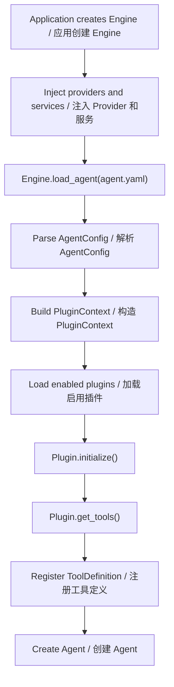
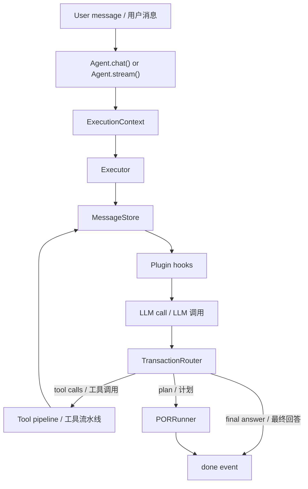

# AxcAgentEngine

**支持 POR（Plan-Observe-Replan）、工具调用和插件体系的 Agent 执行引擎。**  
**Agent execution engine with Plan-Observe-Replan (POR), tool calling, and a plugin architecture.**

AxcAgentEngine 是一个基于 OpenAI-compatible Chat Completions API 的 Python Agent 框架。核心执行层使用 provider 协议，内置客户端是 OpenAI-compatible HTTP adapter。  
AxcAgentEngine is a Python framework for building AI agents on top of OpenAI-compatible Chat Completions APIs. The core execution layer uses a provider protocol, while the built-in client is an OpenAI-compatible HTTP adapter.

## 为什么使用 / Why

多数 Agent 框架主要依赖 ReAct 循环：思考、调用工具、观察结果、继续循环。任务复杂后，ReAct 容易发散。  
Most agent frameworks rely mainly on ReAct loops: think, call tools, observe, repeat. When tasks become complex, plain ReAct loops can drift.

AxcAgentEngine 在 ReAct 之外加入 **POR**：先生成结构化计划，再按依赖调度执行步骤，观察结果，必要时重新规划。  
AxcAgentEngine adds **POR**: the agent creates a structured plan, schedules steps by dependency, observes results, and replans when needed.

## 核心能力 / Core Capabilities

| 能力 / Capability | 当前状态 / Current status |
| --- | --- |
| ReAct 循环 / ReAct loop | 已在 `Executor` 中实现 / Implemented in `Executor` |
| POR 规划 / POR planning | 支持 `auto`、`react_only`、`por_first` 路由 / Supports `auto`, `react_only`, and `por_first` routing |
| 中断恢复 / Durable recovery | `CheckpointStore` + `ExecutionRecoveryService` + Agent resume API / `CheckpointStore`, `ExecutionRecoveryService`, and Agent resume APIs |
| 插件系统 / Plugin system | 内置插件 spec 注册表 + YAML 按需加载 / Built-in plugin spec registry with YAML-driven loading |
| 扩展边界 / Extension boundary | 可选能力属于插件，工具是插件输出 / Optional capabilities live in plugins; tools are plugin outputs |
| LLM Provider | Provider 协议 + OpenAI-compatible HTTP 客户端 / Provider protocol plus OpenAI-compatible HTTP client |
| 并行工具 / Parallel tools | 只读工具并发，写工具串行 / Read-only tools run concurrently; write tools run serially |
| 工具输出协议 / Tool output protocol | 所有工具必须返回 `ToolOutput` / All tools must return `ToolOutput` |
| 工具名兼容 / Tool name compatibility | Provider 负责模型安全函数名映射 / Providers map internal tool names to model-safe function names |
| 上下文压缩 / Context compression | 内置 `compress` 插件 / Built-in `compress` plugin |
| 记忆 / Memory | 四层记忆、KV fallback、去重、衰减、图 hook / Four-layer memory with KV fallback, deduplication, decay, and graph hooks |
| 知识库 / Knowledge | 语义分块、embedding、BM25/向量混合检索、可选 rerank / Semantic chunking, embeddings, BM25/vector hybrid retrieval, and optional rerank |
| MCP | stdio、本地 JSON-RPC HTTP，以及可选官方 SDK transport / stdio, local JSON-RPC HTTP, and optional official SDK transports |
| 人工审批 / Human-in-the-loop | 审批队列和 `ask_human` 工具 / Approval queue and `ask_human` tool |
| 旁路能力 / Sidecar capabilities | 多 Agent、仿真、评测、成本、失败挖掘、轨迹蒸馏 / Multi-agent, simulation, eval, cost, failure mining, and trace distillation |
| API 服务 / API server | OpenAI Chat Completions 兼容子集 / OpenAI Chat Completions compatible subset |

## 开源资料 / Open Source Docs

- 许可证：Apache-2.0，见 [LICENSE](LICENSE)。  
  License: Apache-2.0, see [LICENSE](LICENSE).
- 安全策略：[SECURITY.md](SECURITY.md)。  
  Security policy: [SECURITY.md](SECURITY.md).
- 贡献指南：[CONTRIBUTING.md](CONTRIBUTING.md)。  
  Contribution guide: [CONTRIBUTING.md](CONTRIBUTING.md).
- 变更记录：[CHANGELOG.md](CHANGELOG.md)。  
  Changelog: [CHANGELOG.md](CHANGELOG.md).
- 架构文档：[docs/ARCHITECTURE.md](docs/ARCHITECTURE.md)。  
  Architecture: [docs/ARCHITECTURE.md](docs/ARCHITECTURE.md).
- API 兼容说明：[docs/API.md](docs/API.md)。  
  API compatibility: [docs/API.md](docs/API.md).
- 插件开发：[docs/PLUGIN_DEVELOPMENT.md](docs/PLUGIN_DEVELOPMENT.md)。  
  Plugin development: [docs/PLUGIN_DEVELOPMENT.md](docs/PLUGIN_DEVELOPMENT.md).
- 安全模型：[docs/SECURITY_MODEL.md](docs/SECURITY_MODEL.md)。  
  Security model: [docs/SECURITY_MODEL.md](docs/SECURITY_MODEL.md).
- 示例：[examples/README.md](examples/README.md)。  
  Examples: [examples/README.md](examples/README.md).

## 安装 / Install

```bash
pip install axc-agent-engine
```

可选依赖：  
Optional extras:

```bash
pip install "axc-agent-engine[api]"
pip install "axc-agent-engine[knowledge]"
pip install "axc-agent-engine[all]"
```

## 快速开始 / Quick Start

```python
from axc_agent_engine import Engine, LLMConfig, PluginRegistry
from axc_agent_engine.plugins.builtin import BuiltinToolsPlugin

plugin_registry = PluginRegistry()
plugin_registry.register(BuiltinToolsPlugin)
engine = Engine(
    default_llm=LLMConfig(
        base_url="https://api.openai.com/v1",
        api_key="sk-xxx",
        model="gpt-4o",
    ),
    plugin_registry=plugin_registry,
)

agent = engine.load_agent("./agents/my_agent.yaml")

# 非流式调用 / Non-streaming
result = await agent.chat("Analyze last month's sales data")

# 流式调用 / Streaming
async for event in agent.stream("Build a REST API for user management"):
    if event.type == "stream_delta":
        print(event.content, end="")
    elif event.type == "tool_call":
        print(f"\n[Tool: {event.tool_name}]")
    elif event.type == "plan_created":
        print(f"\n[Plan: {event.content}, {len(event.steps)} steps]")
```

## API 兼容性 / API Compatibility

HTTP API 是 OpenAI Chat Completions 兼容子集。  
The HTTP API is an OpenAI Chat Completions compatible subset.

- `POST /v1/chat/completions`
- `GET /v1/agents`
- `GET /v1/capabilities`

请求级 OpenAI `tools` 和 `tool_choice` 当前刻意不支持。工具来自 Agent YAML 和插件，这样引擎可以统一执行 capability、风险元数据、插件 hooks、workspace policy 和审计事件。  
Request-level OpenAI `tools` and `tool_choice` are intentionally unsupported. Tools are loaded from Agent YAML and plugins so the engine can enforce capabilities, risk metadata, plugin hooks, workspace policy, and audit events.

客户端不应假设完整 OpenAI API 等价；请先调用 `/v1/capabilities` 做能力探测。详见 [docs/API.md](docs/API.md)。  
Clients should not assume full OpenAI API parity. Call `/v1/capabilities` first. See [docs/API.md](docs/API.md).

## Agent YAML

```yaml
name: "data-analyst"
description: "Data analysis assistant"

runtime:
  max_rounds: 50
  thinking: "auto"
  workspace: "/tmp/agent-workspace"
  allowed_capabilities:
    - "file_read"
    - "file_write"
    - "http_request"

system_prompt: |
  You are a data analysis assistant...

plugins:
  builtin_tools:
    enabled: true
    load: ["get_time", "file_read", "file_write", "http_request", "result_read"]
    defer: ["file_write", "http_request"]

  knowledge:
    enabled: true
    sources: ["./docs"]
    namespace: "default"
    embedding:
      base_url: "https://api.openai.com/v1"
      api_key: "sk-xxx"
      model: "text-embedding-3-small"

  memory:
    enabled: true
    namespace: "default"
    scope_keys: ["tenant_id", "user_id", "agent_name"]
    sensitive_policy: "redact"

  compress:
    enabled: true
    summary_after_rounds: 8

  risk_guard:
    enabled: true
```

要点：  
Notes:

- 插件注册由宿主代码通过 `PluginRegistry` 显式完成；Agent YAML 只启用和配置已注册插件。  
  Plugin registration is explicit host code through `PluginRegistry`; Agent YAML only enables and configures already registered plugins.
- `builtin_tools` 未配置 `load` 时只加载 `get_time`。其他内置工具必须显式启用。  
  `builtin_tools` loads only `get_time` when `load` is omitted. Other built-in tools must be explicitly enabled.
- 带非空 capability 的工具默认拒绝，必须写入 `runtime.allowed_capabilities`。  
  Tools with a non-empty capability are denied by default and must be listed in `runtime.allowed_capabilities`.
- 文件和命令类工具默认要求配置 `runtime.workspace`。  
  File and command tools require `runtime.workspace` by default.
- LLM 配置由代码提供，不写在 Agent YAML。  
  LLM configuration is provided by code, not Agent YAML.

## Provider 配置 / Provider Configuration

`Engine` 接收 `LLMConfig`，也接收完整实现 `LLMProvider` 协议的对象，包括 `model`、`tool_name_mapping`、`chat`、`stream`、`ask` 和 `close`。  
`Engine` accepts `LLMConfig` or an object implementing the full `LLMProvider` protocol, including `model`, `tool_name_mapping`, `chat`, `stream`, `ask`, and `close`.

```python
from axc_agent_engine import ConcurrencyConfig, Engine, LLMConfig
from axc_agent_engine.tools.name_mapping import ToolNameMappingConfig

default_llm = LLMConfig(
    base_url="https://api.openai.com/v1",
    api_key="sk-xxx",
    model="gpt-4o",
    timeout=120,
    max_concurrent_requests=32,
    requests_per_minute=0,
    rate_limit_queue_timeout=10,
    tool_name_mapping=ToolNameMappingConfig(),
)

engine = Engine(
    default_llm=default_llm,
    concurrency=ConcurrencyConfig(
        max_engine_concurrent_runs=128,
        queue_timeout=30,
    ),
)
```

多个命名 provider 可以注册到 `engine.provider_registry`，再在 `load_agent(...)` 时按名称选择。  
Multiple named providers can be registered on `engine.provider_registry` and selected by name in `load_agent(...)`.

```python
engine.provider_registry.register("fast", fast_provider)
agent = engine.load_agent("./agents/my_agent.yaml", default_llm="fast")
```

工具名兼容属于 provider 职责。内部工具名会在 LLM 调用前编码成模型安全 function name，并在 hooks/工具执行前解码回来。  
Tool name compatibility belongs to the provider. Internal tool names are encoded to model-safe function names before the LLM call and decoded before hooks/tool execution.

## 内置插件 / Built-in Plugins

不运行基础 Agent 也不必存在的能力都属于插件。Agent YAML 只启用当前 Agent 需要的插件。  
Capabilities not required by a basic Agent belong in plugins. Agent YAML should enable only the plugins a specific Agent needs.

默认 `Engine` 的 `plugin_registry` 为空；内置插件和自定义插件都必须由宿主显式注册。  
The default `Engine` `plugin_registry` is empty; both builtin and custom plugins must be registered explicitly by the host.

```python
from axc_agent_engine import Engine, LLMConfig, PluginRegistry
from axc_agent_engine.plugins.builtin import BuiltinToolsPlugin, MemoryPlugin
from my_project.plugins import MyCustomPlugin

registry = PluginRegistry()
registry.register_many([BuiltinToolsPlugin, MemoryPlugin, MyCustomPlugin])

engine = Engine(default_llm=llm, plugin_registry=registry)
```

| 插件 / Plugin | 用途 / Purpose |
| --- | --- |
| `builtin_tools` | 基础工具和 artifact 分页 / Basic tools and artifact paging |
| `knowledge` | ingestion、语义分块、混合检索、citation、rerank / Ingestion, semantic chunking, hybrid retrieval, citations, rerank |
| `memory` | 记忆、治理工具、敏感信息策略、衰减、TTL / Memory, governance tools, sensitive-data policy, decay, TTL |
| `output_format` | 最终输出契约、校验、修复、审计 / Final output contracts, validation, repair, audit |
| `graph` | 实体/关系图谱搜索和 CRUD / Entity/relation graph search and CRUD |
| `skill` | 加载 skill，脚本通过 sandbox 执行 / Load skills and run scripts through sandbox |
| `mcp` | MCP server 工具加载和治理 / MCP server tool loading and guarding |
| `hooks` | 声明式 LLM/工具 hook 规则 / Declarative LLM/tool hook rules |
| `compress` | 上下文窗口治理、摘要、召回、文件恢复 / Context window management, summaries, recall, file restore |
| `human_in_the_loop` | 人工审批和 `ask_human` / Human approval and `ask_human` |
| `risk_guard` | 动态工具风险分级 / Dynamic tool risk classification |
| `safety` | 输入清洗、prompt injection 检测、PII 脱敏 / Input sanitization, prompt-injection checks, PII masking |
| `tracing` | trace/span 采集、审计模式、查询工具 / Trace/span collection, audit mode, query tools |
| `reflexion` | 轮次结束和运行结束的自我反思 / End-of-round and end-of-run self-reflection |
| `repetition_guard` | 重复工具调用、回复或结果检测 / Repeated tool, response, or result detection |
| `cost_statistics` | token 和工具调用次数统计 / Token and tool-call accounting |
| `collaboration` | Agent 间调用和宿主编排薄入口 / Agent-to-agent calls and thin host orchestration client |
| `swarm` | 轻量并行 fan-out / Lightweight parallel fan-out |

## 旁路能力 / Sidecar Capabilities

旁路能力统一放在 `axc_agent_engine.sidecar`，由宿主显式调用，不属于 Agent 核心执行链路。详见 [axc_agent_engine/sidecar/README.md](axc_agent_engine/sidecar/README.md)。  
Sidecar capabilities live under `axc_agent_engine.sidecar` and are invoked explicitly by host applications. They are not part of the Agent core execution path. See [axc_agent_engine/sidecar/README.md](axc_agent_engine/sidecar/README.md).

| 包 / Package | 用途 / Purpose |
| --- | --- |
| `sidecar.multi_agent` | 多 Agent 会话、调度器、停止条件、共享上下文 / Multi-agent sessions, schedulers, stop conditions, shared context |
| `sidecar.simulation` | 结构化仿真内核 / Structured simulation kernel |
| `sidecar.eval` | 评测 case、标注 store、matcher、runner、report / Evaluation cases, annotation stores, matcher, runner, reports |
| `sidecar.agent_selector` | 宿主侧 Agent 路由和候选评分 / Host-side Agent routing and candidate scoring |
| `sidecar.distiller` | 从轨迹蒸馏规则、工具偏好和 skill 候选 / Distill rules, tool preferences, and skill candidates from traces |
| `sidecar.failure_miner` | 聚类失败并建议修复/eval 覆盖 / Cluster failures and suggest remediation/eval coverage |
| `sidecar.cost_optimizer` | 成本估算和优化建议 / Cost estimation and optimization findings |

```python
from axc_agent_engine.sidecar import OrchestrationTaskService
from axc_agent_engine.storage.in_memory import InMemoryMessageBus

engine = Engine(default_llm=default_llm, message_bus=InMemoryMessageBus())
red = engine.load_agent("./agents/red.yaml")
blue = engine.load_agent("./agents/blue.yaml")

service = OrchestrationTaskService(
    agent_getter=engine.get_agent,
    agent_lister=engine.list_agents,
    dispatcher=engine._dispatcher,
    utility_llm=utility_llm,
)

task = await service.run_task(
    agent_names=[red.name, blue.name],
    mode="redblue",
    topic="Plugin marketplace security tabletop",
    max_rounds=3,
)
```

## 运行流程 / Runtime Flow

### 加载期 / Load Time



### 单次运行 / One Agent Run



## 插件开发 / Plugin Development

```python
from axc_agent_engine import BasePlugin, ToolDefinition, ToolOutput

class MyPlugin(BasePlugin):
    name = "my_plugin"
    display_name = "My Plugin"
    priority = 30
    phase = "core"

    def initialize(self, config: dict, ctx) -> None:
        super().initialize(config, ctx)
        self.api_url = config["api_url"]

    def get_tools(self) -> list[ToolDefinition]:
        return [ToolDefinition(
            name="my_tool",
            description="Does something useful",
            parameters={"type": "object", "properties": {"query": {"type": "string"}}},
            execute=self._execute,
        )]

    async def pre_tool_call(self, exec_ctx, tool_name, arguments):
        return True, arguments

    async def _execute(self, args: dict, context: dict) -> ToolOutput:
        return ToolOutput.text(f"Result for {args['query']}")
```

插件必须继承 `BasePlugin`，工具必须返回 `ToolDefinition` 实例；`ToolRegistry` 不接受 dict 工具定义。  
Plugins must inherit `BasePlugin`, and tools must be returned as `ToolDefinition` instances; `ToolRegistry` does not accept dict tool definitions.

```yaml
plugins:
  my_plugin:
    enabled: true
    api_url: "http://localhost:5000"
```

## CLI

```bash
export AXC_LLM_BASE_URL="https://api.openai.com/v1"
export AXC_LLM_API_KEY="sk-xxx"
export AXC_LLM_MODEL="gpt-4o"

axc chat --agent ./agents/my_agent.yaml
axc serve --agent ./agents/my_agent.yaml --port 8000
axc --log-level DEBUG --json-logs chat --agent ./agents/my_agent.yaml
```

CLI 日志参数是全局参数，需要放在子命令前。  
CLI logging flags are global flags and must be placed before the subcommand.

## 设计决策 / Design Decisions

- **Engine core = Executor + LLMCaller。** 引擎读取 Agent YAML，调用配置好的 LLM Provider，运行 Agent 循环，并输出事件和结果。  
  **Engine core = Executor + LLMCaller.** The engine reads Agent YAML, calls configured LLM providers, runs the Agent loop, and emits events/results.
- **插件是运行时扩展边界。** 知识库、记忆、图谱、MCP、输出修复、Skill 等直接增强单次 Agent 运行的能力都属于插件。  
  **Plugins are the runtime extension boundary.** Knowledge, memory, graph, MCP, output repair, and skills belong in plugins.
- **推演是旁路。** 多 Agent session、simulation kernel 和 mode adapter 是宿主驱动 SDK 能力。  
  **Orchestration is sidecar.** Multi-agent sessions, simulation kernel, and mode adapters are host-driven SDK capabilities.
- **评测是旁路。** EvalRunner、EvalStore、AnnotationStore、AnnotationMatcher 和 report 是宿主驱动测试框架。  
  **Evaluation is sidecar.** EvalRunner, EvalStore, AnnotationStore, AnnotationMatcher, and reports are host-driven test framework pieces.
- **注册不是加载。** 内置 spec 注册表是完整插件表；Agent 只加载 YAML 中 enabled 的插件。  
  **Registration is not loading.** The built-in spec registry is the full known plugin table; an Agent loads only YAML-enabled plugins.
- **工具来自插件。** Engine 核心不内置业务工具。  
  **Tools come from plugins.** The engine core does not embed business tools.
- **工具必须返回 `ToolOutput`。** 非 `ToolOutput` 返回会被工具执行器拒绝。  
  **Tools must return `ToolOutput`.** Non-`ToolOutput` returns are rejected by the tool executor.
- **工具定义必须是 `ToolDefinition`。** 插件 `get_tools()` 不能返回 dict；注册表会拒绝非 `ToolDefinition` 实例。  
  **Tool definitions must be `ToolDefinition`.** Plugin `get_tools()` must not return dicts; the registry rejects non-`ToolDefinition` instances.
- **业务协议不进入开源引擎。** 内部 API、私有数据库、公司鉴权、服务发现、敏感工具应放在私有插件中。  
  **Business protocols stay out of the open-source engine.** Internal APIs, private databases, company auth, service discovery, and sensitive tools belong in private plugins.
- **LLM 配置在代码中。** Agent YAML 只描述运行时限制、能力和插件。  
  **LLM configuration lives in code.** Agent YAML describes runtime limits, capabilities, and plugins.
- **OpenAI-compatible API 是兼容子集。** 请求级 `tools`、`tool_choice`、`n > 1` 当前会被拒绝。  
  **The OpenAI-compatible API is a subset.** Request-level `tools`, `tool_choice`, and `n > 1` are currently rejected.

## 测试 / Tests

```bash
python3 -m pytest -q
```
