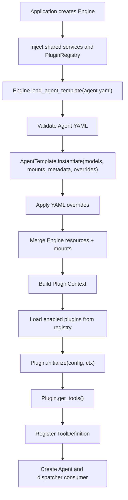
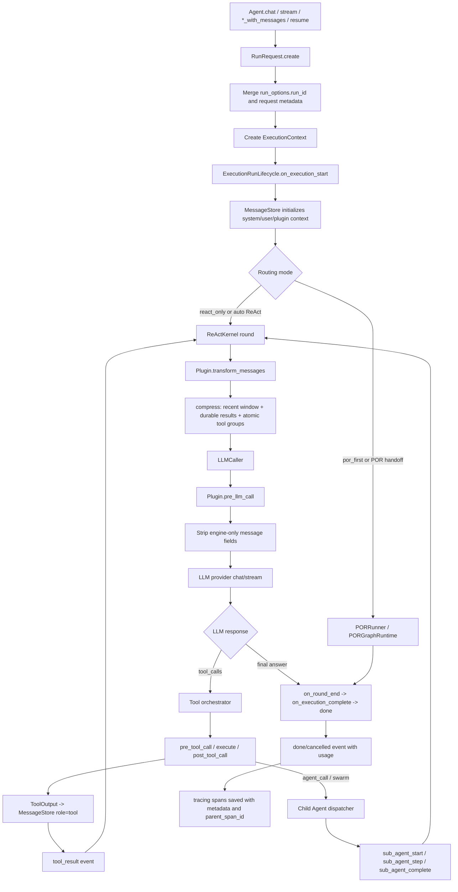

<h1 align="center">AxcAgentEngine</h1>

<p align="center">
  <b>Agent execution engine with Plan-Observe-Replan, tool calling, and a plugin system</b>
</p>

<p align="center">
  
  
  
  
</p>

<p align="center">
  <a href="#-quick-start">Quick Start</a> &middot;
  <a href="#-features">Features</a> &middot;
  <a href="docs/ARCHITECTURE.md">Architecture</a> &middot;
  <a href="docs/PLUGIN_DEVELOPMENT.md">Plugins</a> &middot;
  <a href="examples/README.md">Examples</a>
</p>

<p align="center">
  <a href="README.zh-CN.md">&#x1F1E8;&#x1F1F3; Chinese</a>
</p>

---

Most agent frameworks rely on a ReAct loop: think, call a tool, observe, repeat. As tasks grow more complex, plain ReAct tends to drift.

AxcAgentEngine adds **POR (Plan-Observe-Replan)** on top of ReAct: the agent produces a structured plan, schedules steps by dependency, observes outcomes, and replans when needed.

## 🚀 Quick Start

```bash
pip install axc-agent-engine

# Pin the current 2.3 release
pip install axc-agent-engine==2.3.2

# Optional extras
pip install "axc-agent-engine[api]"
pip install "axc-agent-engine[workflow]"
pip install "axc-agent-engine[api,knowledge,workflow]"
```

Requires Python 3.11 or newer.

```python
from axc_agent_engine import AgentModels, Engine, LLMConfig, PluginRegistry
from axc_agent_engine.llm.client import OpenAIClient
from axc_agent_engine.plugins.builtin import BuiltinToolsPlugin

registry = PluginRegistry()
registry.register(BuiltinToolsPlugin)

engine = Engine(plugin_registry=registry)
models = AgentModels(default=OpenAIClient(LLMConfig(
    base_url="https://api.openai.com/v1",
    api_key="sk-xxx",
    model="gpt-4o",
)))
agent = engine.load_agent_template("./agents/my_agent.yaml").instantiate(models=models)

# Non-streaming
result = await agent.chat("Analyze last month's sales data")

# Streaming
async for event in agent.stream("Build a REST API for user management"):
    if event.type == "stream_delta":
        print(event.content, end="")
    elif event.type == "tool_call":
        print(f"\n[Tool: {event.tool_name}]")
    elif event.type == "plan_created":
        print(f"\n[Plan: {event.content}, {len(event.steps)} steps]")
```

## ✨ Features

- **POR planning** - structured plans, dependency scheduling, replanning; routes via `auto` / `react_only` / `por_first`
- **ReAct executor** - standard think / call / observe loop
- **Plugin system** - built-in spec registry, YAML-driven loading; optional capabilities live in plugins
- **Tool protocol** - every tool returns `ToolOutput`; read-only runs concurrent, write serial; safe function-name mapping
- **Durable workflow** - `WorkflowRuntime` + `CheckpointStore` + Agent resume API; Burr is optional via `axc-agent-engine[workflow]`
- **OpenAI compatible** - provider protocol + OpenAI-compatible HTTP client and API subset
- **Memory & knowledge** - four-layer memory (KV, dedup, decay, graph hooks) + plugin-owned hybrid retrieval
- **Runtime binding** - models, mounted resources, request metadata, and YAML overrides stay in separate channels
- **MCP** - stdio, JSON-RPC HTTP, official SDK transports
- **Human-in-the-loop** - approval queue and `ask_human` tool
- **Sidecar suite** - multi-agent, simulation, eval, cost, failure mining, trace distillation

<details>
<summary>Full capability matrix</summary>

| Capability | Implementation |
| --- | --- |
| ReAct loop | `Executor` |
| POR planning | `auto` / `react_only` / `por_first` |
| Durable workflow | `MemoryWorkflowRuntime` by default; optional `BurrWorkflowRuntime` via `axc-agent-engine[workflow]` |
| Plugin system | spec registry + YAML-driven loading |
| LLM provider | provider protocol + OpenAI-compatible HTTP |
| Parallel tools | read concurrent, write serial |
| Tool output | enforced `ToolOutput` |
| Tool name mapping | provider-side model-safe mapping |
| Context compression | built-in `compress` plugin |
| Memory | four layers + KV persistence + dedup + decay |
| Knowledge | plugin-owned retrieval over local sources or mounted indexes/resources |
| MCP | stdio / JSON-RPC HTTP / official SDK |
| Human approval | approval queue + `ask_human` |
| Sidecar | multi-agent / simulation / eval / cost / failure mining / distillation |
| API server | OpenAI Chat Completions compatible subset |

</details>

## 📦 Docs

| | |
| --- | --- |
| [Architecture](docs/ARCHITECTURE.md) | Engine and plugin boundaries |
| [API](docs/API.md) | HTTP API subset notes |
| [Plugin development](docs/PLUGIN_DEVELOPMENT.md) | Build your own plugin |
| [Security model](docs/SECURITY_MODEL.md) | Capabilities, risk, workspace |
| [Examples](examples/README.md) | 7 end-to-end demos |
| [Contributing](CONTRIBUTING.md) / [Security](SECURITY.md) / [LICENSE](LICENSE) | Apache-2.0 |

## Agent YAML

```yaml
name: "data-analyst"
description: "Data analysis assistant"

runtime:
  max_rounds: 50
  thinking: "auto"
  workspace: "/tmp/agent-workspace"
  allowed_capabilities:
    - "file_read"
    - "file_write"
    - "http_request"

system_prompt: |
  You are a data analysis assistant...

plugins:
  builtin_tools:
    enabled: true
    load: ["get_time", "file_read", "file_write", "http_request", "result_read"]
    defer: ["file_write", "http_request"]

  knowledge:
    enabled: true
    sources: ["./docs"]
    namespace: "default"

  memory:
    enabled: true
    namespace: "default"
    scope_keys: ["tenant_id", "user_id", "agent_name"]
    sensitive_policy: "redact"

  compress:
    enabled: true
    summary:
      after_rounds: 8
    durable_tools:
      names: ["agent_call", "knowledge_search"]
      keep: 12

  risk_guard:
    enabled: true
```

Notes:

- Plugin registration is explicit host code via `PluginRegistry`. Agent YAML only enables and configures already-registered plugins.
- `builtin_tools` loads only `get_time` when `load` is omitted; other built-ins must be explicitly enabled.
- Tools with a non-empty capability are denied by default; list them in `runtime.allowed_capabilities`.
- File and command tools require `runtime.workspace` by default.
- LLM configuration is provided in code, not in Agent YAML.
- Official builtin plugin YAML is for behavior parameters only. External endpoints, API keys, client objects, indexes, stores, and catalogs are mounted in code.

## Provider Configuration

`AgentModels` accepts model provider objects. `OpenAIClient(LLMConfig(...))` is the built-in OpenAI-compatible provider; custom providers implement `LLMProvider` (`model`, `tool_name_mapping`, `chat`, `stream`, `ask`, `close`).

```python
from axc_agent_engine import AgentModels, ConcurrencyConfig, Engine, LLMConfig
from axc_agent_engine.llm.client import OpenAIClient
from axc_agent_engine.tools.name_mapping import ToolNameMappingConfig

main_model_config = LLMConfig(
    base_url="https://api.openai.com/v1",
    api_key="sk-xxx",
    model="gpt-4o",
    timeout=120,
    max_concurrent_requests=32,
    requests_per_minute=0,
    rate_limit_queue_timeout=10,
    tool_name_mapping=ToolNameMappingConfig(),
)

engine = Engine(
    concurrency=ConcurrencyConfig(
        max_engine_concurrent_runs=128,
        queue_timeout=30,
    ),
)
agent = engine.load_agent_template("./agents/my_agent.yaml").instantiate(
    models=AgentModels(default=OpenAIClient(main_model_config)),
)
```

Tool-name mapping is the provider's job. Internal tool names are encoded to model-safe function names before the LLM call and decoded before hooks and tool execution.

## Runtime Binding

Agent YAML describes stable behavior. Runtime objects are bound in code when the template is instantiated:

```python
agent = template.instantiate(
    models=AgentModels(
        default=gpt5_provider,
        utility=fast_provider,
        fallback=backup_provider,
    ),
    mounts={
        "knowledge.index": tenant_knowledge_index,
        "graph.store": tenant_graph_store,
        "skill.catalog": tenant_skill_catalog,
    },
    metadata={
        "tenant_id": "t_001",
    },
    overrides={
        "plugins.knowledge.namespace": "tenant:t_001",
        "plugins.skill.timeout": 30,
    },
)
```

- `models` binds provider objects for this Agent instance; the Engine does not own model configuration.
- `mounts` injects host-owned runtime resources for this instantiation and overrides Engine-level resources with the same name.
- `metadata` attaches instance metadata; request metadata can still override it inside a single chat/stream call.
- `overrides` patches validated Agent YAML fields before plugins are initialized. It only accepts YAML-serializable values and cannot bind runtime resources.

Preferred official resource slots are `knowledge.index`, `graph.store`, `skill.catalog`, and `tracing.exporter`. Advanced knowledge slots such as `knowledge.documents`, `knowledge.embedding`, `knowledge.vector_store`, and `knowledge.reranker` are also supported by the current plugin, but they are still runtime mounts, not YAML or `overrides` values.

## Request Metadata and Tracing

Run-level metadata is passed through the public Agent entry points and reaches `ExecutionContext.state.metadata`. The tracing plugin copies this metadata into every span, while keeping top-level `run_id`, `session_id`, `span_id`, and `parent_span_id`.

```python
async for event in agent.stream_with_messages(
    messages,
    session_id="123",
    llm_options={"temperature": 0.2},
    run_options={"run_id": "run_abc"},
    metadata={
        "external_trace_id": "trace_1001",
        "conversation_id": 123,
        "agent_profile_id": 9,
    },
):
    ...
```

Use this for host-side trace or audit correlation. Do not encode external correlation IDs in prompts, tool arguments, or fake tool messages.

## Cancellation and Usage

Every run receives a `run_id` through `run_options.run_id`, `metadata.run_id`, or engine generation. Hosts should cancel a run through the Engine so nested `agent_call`, swarm, sidecar-owned Agent runs, and active tools share the same cancellation signal:

```python
engine.cancel_run("run_abc", reason="user_cancelled")
```

Streaming callers receive a terminal `cancelled` event. Non-streaming callers receive `CancelledError`. Terminal `done` and `cancelled` events include aggregated usage in `event.metadata["usage"]`:

```python
{
    "input_tokens": 1200,
    "output_tokens": 380,
    "total_tokens": 1580,
}
```

Hosts should read this aggregate instead of summing scattered LLM or sub-Agent events.

## Multimodal Messages

The host owns uploads, authorization, OCR, image recognition, media URLs, and base64 generation. The engine only accepts normalized message content parts and passes them through the input/provider boundary:

```python
messages = [{
    "role": "user",
    "content": [
        {"type": "text", "text": "Explain this screenshot."},
        {"type": "image_url", "image_url": {"url": "https://example.com/screen.png"}},
        {"type": "image_base64", "media_type": "image/png", "data": "..."},
        {"type": "file_ref", "ref": "artifact:123", "metadata": {"name": "report.pdf"}},
    ],
}]
```

Unsupported part types fail immediately. Official plugins do not fetch host media services or perform deployment-specific multimodal preprocessing.

## Tool Output Views

`ToolOutput` separates the LLM context view from the UI display view:

- `context_view(max_chars=2000)` is written into `MessageStore` for the next LLM round. It prefers `durable_summary`, then `summary`, then compact content, and preserves artifact refs.
- `display_view(max_chars=0)` is used by `tool_result` events for host/UI display. It can expose full content or artifact refs without polluting LLM context.
- `compact_view()` is not a UI contract. New code should call `context_view()` or `display_view()` explicitly.

Hosts should not monkey patch `ToolOutput` to change LLM context behavior.

## Durable Tool Results and Sub-Agent Events

The `compress` plugin preserves assistant tool calls and their matching tool results as atomic groups. Durable tool results are also saved into the compression boundary and reinjected after context packing. By default, `agent_call` and `knowledge_search` are durable; domain tools can opt in with `compress.durable_tools.names`, `compress.durable_tools.capabilities`, or `ToolOutput.with_metadata({"durable": True, "durable_summary": "..."})`.

`collaboration.agent_call` streams child Agent activity back to the parent run as standard events:

- `sub_agent_start`
- `sub_agent_step`
- `sub_agent_complete`

Stable fields include `parent_tool_call_id`, `sub_run_id`, `agent_name`, `agent_id`, `step.type`, `tool_call_id`, `tool_name`, `content`, `artifacts`, `error`, and `duration_ms`. Frontends should render these events directly. They should not parse `agent_call` tool results to invent a child execution timeline.

## API

The HTTP API is an OpenAI Chat Completions compatible subset.

- `POST /v1/chat/completions`
- `GET /v1/agents`
- `GET /v1/capabilities`

Request-level `tools` and `tool_choice` are intentionally unsupported. Tools come from Agent YAML and plugins so the engine can enforce capabilities, risk metadata, plugin hooks, workspace policy, and audit events.

Clients should not assume full OpenAI parity; call `/v1/capabilities` first. See [docs/API.md](docs/API.md).

## Built-in Plugins

Capabilities not required by a basic agent live in plugins. The default `Engine.plugin_registry` is empty; both built-in and custom plugins must be registered explicitly.

```python
from axc_agent_engine import AgentModels, Engine, PluginRegistry
from axc_agent_engine.plugins.builtin import BuiltinToolsPlugin, MemoryPlugin
from my_project.plugins import MyCustomPlugin

registry = PluginRegistry()
registry.register_many([BuiltinToolsPlugin, MemoryPlugin, MyCustomPlugin])
engine = Engine(plugin_registry=registry)
agent = engine.load_agent_template("./agents/my_agent.yaml").instantiate(models=AgentModels(default=llm))
```

| Plugin | Purpose |
| --- | --- |
| `builtin_tools` | Basic tools and artifact paging |
| `knowledge` | Ingestion, semantic chunking, hybrid retrieval, citations, rerank |
| `memory` | Memory, governance tools, sensitive-data policy, decay, TTL |
| `output_format` | Final output contracts, validation, repair, audit |
| `graph` | Entity/relation graph search and CRUD |
| `skill` | Load skills, run scripts through sandbox |
| `mcp` | MCP server tool loading and guarding |
| `hooks` | Declarative LLM/tool hook rules |
| `compress` | Context window management, summaries, recall, file restore |
| `human_in_the_loop` | Human approval and `ask_human` |
| `risk_guard` | Dynamic tool risk classification |
| `safety` | Input sanitization, prompt-injection checks, PII masking |
| `tracing` | Trace/span collection, audit mode, query tools |
| `reflexion` | End-of-round and end-of-run self-reflection |
| `repetition_guard` | Repeated tool / response / result detection |
| `cost_statistics` | Token and tool-call accounting |
| `collaboration` | Agent-to-agent calls and host orchestration entry |
| `swarm` | Lightweight parallel fan-out |

## Sidecar Capabilities

Sidecars live under `axc_agent_engine.sidecar` and are invoked explicitly by the host, not part of the agent's core execution path. See [axc_agent_engine/sidecar/README.md](axc_agent_engine/sidecar/README.md).

| Package | Purpose |
| --- | --- |
| `sidecar.multi_agent` | Multi-agent sessions, schedulers, stop conditions, shared context |
| `sidecar.simulation` | Structured simulation kernel |
| `sidecar.eval` | Evaluation cases, annotation stores, matcher, runner, reports |
| `sidecar.agent_selector` | Host-side agent routing and candidate scoring |
| `sidecar.distiller` | Distill rules, tool preferences, and skill candidates from traces |
| `sidecar.failure_miner` | Cluster failures and suggest remediation / eval coverage |
| `sidecar.cost_optimizer` | Cost estimation and optimization findings |

```python
from axc_agent_engine import AgentModels, Engine
from axc_agent_engine.sidecar import OrchestrationTaskService
from axc_agent_engine.storage.in_memory import InMemoryMessageBus

engine = Engine(message_bus=InMemoryMessageBus())
models = AgentModels(default=main_model, utility=utility_model)
red = engine.load_agent_template("./agents/red.yaml").instantiate(models=models)
blue = engine.load_agent_template("./agents/blue.yaml").instantiate(models=models)

service = OrchestrationTaskService(
    agent_getter=engine.get_agent,
    agent_lister=engine.list_agents,
    dispatcher=engine._dispatcher,
    utility_model=utility_model,
)

task = await service.run_task(
    agent_names=[red.name, blue.name],
    mode="redblue",
    topic="Plugin marketplace security tabletop",
    max_rounds=3,
)
```

Sidecar components that create internal Agent runs accept standard run context:

- `EvalRunner.run_cases(..., run_options, metadata, case_run_options, case_metadata)`
- `MultiAgentSession.run/stream(..., run_options, metadata, agent_run_options, agent_metadata)`
- `SimulationRunner.run/stream(..., run_options, metadata, actor_run_options, actor_metadata)`

Factory metadata supplements the base metadata for each case, agent, or actor. `EvalCase.metadata` remains evaluation/scoring metadata and is not request metadata.

## Runtime Flow

### Load time



### One agent run



## Plugin Development

```python
from axc_agent_engine import BasePlugin, ToolDefinition, ToolOutput
from axc_agent_engine.plugins.config_schema import config_field, config_schema

class MyPlugin(BasePlugin):
    name = "my_plugin"
    display_name = "My Plugin"
    priority = 30
    phase = "core"
    config_schema = config_schema(
        "my_plugin",
        "My Plugin",
        "Configuration for MyPlugin.",
        [
            config_field(
                "api_url",
                "接口地址",
                "string",
				"插件调用的后端接口地址。",
				label_en="API URL",
				default="http://localhost:5000",
			),
		],
        display_name_en="My Plugin",
    )

    def initialize(self, config: dict, ctx) -> None:
        super().initialize(config, ctx)
        self.api_url = config["api_url"]

    def get_tools(self) -> list[ToolDefinition]:
        return [ToolDefinition(
            name="my_tool",
            description="Does something useful",
            parameters={"type": "object", "properties": {"query": {"type": "string"}}},
            execute=self._execute,
        )]

    async def pre_tool_call(self, exec_ctx, tool_name, arguments):
        return True, arguments

    async def _execute(self, args: dict, context: dict) -> ToolOutput:
        return ToolOutput.text(f"Result for {args['query']}")
```

Plugins must inherit `BasePlugin`, declare `config_schema`, and return tools as `ToolDefinition` instances. `ToolRegistry` does not accept dicts.

Hosts can inspect registered plugin schemas through `registry.list_plugin_config_schemas()` or `registry.get_plugin_config_schema("my_plugin")`. The schema is for UI, templates, default display, and optional validation; YAML extra keys are still passed to `initialize(config, ctx)`.

```yaml
plugins:
  my_plugin:
    enabled: true
    api_url: "http://localhost:5000"
```

## CLI

```bash
export AXC_LLM_BASE_URL="https://api.openai.com/v1"
export AXC_LLM_API_KEY="sk-xxx"
export AXC_LLM_MODEL="gpt-4o"

axc chat --agent ./agents/my_agent.yaml
axc serve --agent ./agents/my_agent.yaml --port 8000
axc --log-level DEBUG --json-logs chat --agent ./agents/my_agent.yaml
```

CLI logging flags are global and must be placed before the subcommand.

## Design Decisions

- **Engine core = Executor + ReActKernel + LLMCaller.** Reads Agent YAML, calls LLM providers, runs the ReAct loop, emits events/results.
- **POR state transitions live in pydantic-graph.** `PORGraphRuntime` owns the plan/step/observe/replan loop; services execute work and persist checkpoints.
- **Workflow resume is a runtime boundary.** `MemoryWorkflowRuntime` is the default; `BurrWorkflowRuntime` is selected when the optional workflow dependency is installed.
- **Plugins are the runtime extension boundary.** Knowledge, memory, graph, MCP, output repair, skills belong in plugins.
- **Orchestration is sidecar.** Multi-agent sessions, simulation, mode adapters are host-driven.
- **Evaluation is sidecar.** EvalRunner, stores, matchers, reports are host-driven test framework pieces.
- **Registration is not loading.** The spec registry is the full plugin table; agents load only YAML-enabled plugins.
- **Plugin schema is mandatory.** A plugin without `config_schema` cannot be registered.
- **Tools come from plugins.** The engine core embeds no business tools.
- **Tools must return `ToolOutput`.** Non-`ToolOutput` returns are rejected.
- **Tool definitions must be `ToolDefinition`.** No dicts.
- **Deployment-specific protocols stay out.** External APIs, deployment databases, auth flows, and service discovery belong in host plugins.
- **LLM config lives in code.** Agent YAML describes runtime limits, capabilities, and plugins.
- **Fatal errors are not hidden by fallback logic.** Invalid configuration, invalid runtime resources, broken tool contracts, and flow errors must fail clearly.
- **Official plugins stay lean.** They may strengthen Agent behavior, but they do not own host network clients, deployment API keys, external services, or deployment-specific protocols.
- **Runtime resources use mounts.** Do not pass resources through YAML or `overrides`.
- **Request correlation uses metadata.** Hosts pass external trace identifiers through `metadata`; tracing spans persist them directly.
- **The API is a subset.** Request-level `tools`, `tool_choice`, `n > 1` are rejected.

## Tests

```bash
python3 -m pytest -q
python3 -m pytest --cov --cov-report=term-missing:skip-covered -q
```

The release gate requires at least 95% total coverage.
