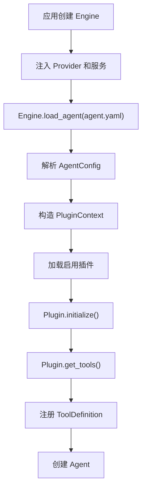
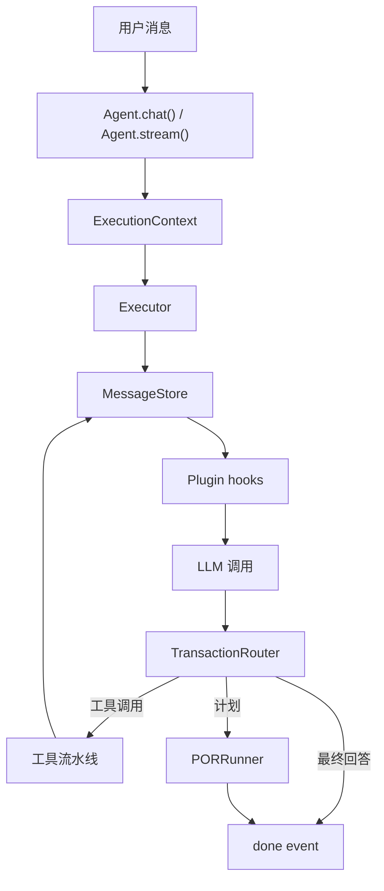

<h1 align="center">AxcAgentEngine</h1>

<p align="center">
  <b>带 POR 规划的 Agent 执行引擎 · 工具调用 · 插件体系</b>
</p>

<p align="center">
  
  
  
</p>

<p align="center">
  <a href="#-快速开始">快速开始</a> ·
  <a href="#-核心能力">核心能力</a> ·
  <a href="docs/ARCHITECTURE.md">架构</a> ·
  <a href="docs/PLUGIN_DEVELOPMENT.md">插件开发</a> ·
  <a href="examples/README.md">示例</a>
</p>

<p align="center">
  <a href="README.md">🇬🇧 English</a>
</p>

---

多数 Agent 框架靠 ReAct 循环跑：思考 → 调工具 → 观察 → 继续。任务复杂时容易发散。

AxcAgentEngine 在 ReAct 之外加了 **POR（Plan-Observe-Replan）**：先生成结构化计划，按依赖调度，观察结果，必要时重新规划。

## 🚀 快速开始

```bash
pip install axc-agent-engine
```

<details>
<summary>可选依赖</summary>

```bash
pip install "axc-agent-engine[api]"        # HTTP API 服务
pip install "axc-agent-engine[knowledge]"  # 知识库 / RAG
pip install "axc-agent-engine[all]"        # 全部
```

</details>

```python
from axc_agent_engine import Engine, LLMConfig, PluginRegistry
from axc_agent_engine.plugins.builtin import BuiltinToolsPlugin

registry = PluginRegistry()
registry.register(BuiltinToolsPlugin)

engine = Engine(
    default_llm=LLMConfig(
        base_url="https://api.openai.com/v1",
        api_key="sk-xxx",
        model="gpt-4o",
    ),
    plugin_registry=registry,
)

agent = engine.load_agent("./agents/my_agent.yaml")

# 非流式
result = await agent.chat("Analyze last month's sales data")

# 流式
async for event in agent.stream("Build a REST API for user management"):
    if event.type == "stream_delta":
        print(event.content, end="")
    elif event.type == "tool_call":
        print(f"\n[Tool: {event.tool_name}]")
    elif event.type == "plan_created":
        print(f"\n[Plan: {event.content}, {len(event.steps)} steps]")
```


## ✨ 核心能力

- **POR 规划** —— 结构化计划 + 依赖调度 + 重新规划，支持 `auto` / `react_only` / `por_first` 路由
- **ReAct 执行器** —— 思考、工具调用、观察的标准循环
- **插件体系** —— 内置 spec 注册表，YAML 按需加载；可选能力都在插件里
- **工具协议** —— 所有工具返回 `ToolOutput`；只读并发，写串行；模型函数名安全映射
- **中断恢复** —— `CheckpointStore` + `ExecutionRecoveryService` + Agent resume API
- **OpenAI 兼容** —— Provider 协议 + OpenAI-compatible HTTP 客户端 / API 子集
- **记忆与知识** —— 四层记忆（KV、去重、衰减、图 hook）+ 语义分块 + 向量/BM25 混合检索
- **MCP** —— stdio、JSON-RPC HTTP、官方 SDK transport
- **人工介入** —— 审批队列、`ask_human` 工具
- **Sidecar 套件** —— 多 Agent、仿真、评测、成本统计、失败挖掘、轨迹蒸馏

<details>
<summary>完整能力矩阵</summary>

| 能力 | 实现 |
| --- | --- |
| ReAct 循环 | `Executor` |
| POR 规划 | `auto` / `react_only` / `por_first` |
| 中断恢复 | `CheckpointStore` + `ExecutionRecoveryService` + Agent resume |
| 插件系统 | spec 注册表 + YAML 按需加载 |
| LLM Provider | Provider 协议 + OpenAI-compatible HTTP |
| 并行工具 | 只读并发，写串行 |
| 工具输出 | 强制 `ToolOutput` |
| 工具名兼容 | Provider 负责模型安全映射 |
| 上下文压缩 | 内置 `compress` 插件 |
| 记忆 | 四层 + KV fallback + 去重 + 衰减 + 图 hook |
| 知识库 | 语义分块 + embedding + BM25/向量 + 可选 rerank |
| MCP | stdio / JSON-RPC HTTP / 官方 SDK |
| 人工审批 | 审批队列 + `ask_human` |
| Sidecar | 多 Agent / 仿真 / 评测 / 成本 / 失败挖掘 / 蒸馏 |
| API 服务 | OpenAI Chat Completions 兼容子集 |

</details>

## 📦 文档

| | |
| --- | --- |
| [架构](docs/ARCHITECTURE.md) | 引擎与插件边界 |
| [API 兼容性](docs/API.md) | HTTP API 子集说明 |
| [插件开发](docs/PLUGIN_DEVELOPMENT.md) | 写自己的插件 |
| [安全模型](docs/SECURITY_MODEL.md) | 能力、风险、workspace |
| [示例](examples/README.md) | 7 个端到端 demo |
| [贡献](CONTRIBUTING.md) · [安全](SECURITY.md) · [变更](CHANGELOG.md) · [LICENSE](LICENSE) | Apache-2.0 |

## Agent YAML

```yaml
name: "data-analyst"
description: "Data analysis assistant"

runtime:
  max_rounds: 50
  thinking: "auto"
  workspace: "/tmp/agent-workspace"
  allowed_capabilities:
    - "file_read"
    - "file_write"
    - "http_request"

system_prompt: |
  You are a data analysis assistant...

plugins:
  builtin_tools:
    enabled: true
    load: ["get_time", "file_read", "file_write", "http_request", "result_read"]
    defer: ["file_write", "http_request"]

  knowledge:
    enabled: true
    sources: ["./docs"]
    namespace: "default"
    embedding:
      base_url: "https://api.openai.com/v1"
      api_key: "sk-xxx"
      model: "text-embedding-3-small"

  memory:
    enabled: true
    namespace: "default"
    scope_keys: ["tenant_id", "user_id", "agent_name"]
    sensitive_policy: "redact"

  compress:
    enabled: true
    summary_after_rounds: 8

  risk_guard:
    enabled: true
```

要点：

- 插件注册由宿主代码通过 `PluginRegistry` 显式完成；Agent YAML 只启用和配置已注册插件。
- `builtin_tools` 未配置 `load` 时只加载 `get_time`，其他内置工具必须显式启用。
- 带非空 capability 的工具默认拒绝，必须写入 `runtime.allowed_capabilities`。
- 文件和命令类工具默认要求配置 `runtime.workspace`。
- LLM 配置由代码提供，不写在 Agent YAML。

## Provider 配置

`Engine` 接收 `LLMConfig`，也接收实现完整 `LLMProvider` 协议的对象（`model`、`tool_name_mapping`、`chat`、`stream`、`ask`、`close`）。

```python
from axc_agent_engine import ConcurrencyConfig, Engine, LLMConfig
from axc_agent_engine.tools.name_mapping import ToolNameMappingConfig

default_llm = LLMConfig(
    base_url="https://api.openai.com/v1",
    api_key="sk-xxx",
    model="gpt-4o",
    timeout=120,
    max_concurrent_requests=32,
    requests_per_minute=0,
    rate_limit_queue_timeout=10,
    tool_name_mapping=ToolNameMappingConfig(),
)

engine = Engine(
    default_llm=default_llm,
    concurrency=ConcurrencyConfig(
        max_engine_concurrent_runs=128,
        queue_timeout=30,
    ),
)
```

多个命名 provider 可注册到 `engine.provider_registry`，在 `load_agent(...)` 时按名称选择：

```python
engine.provider_registry.register("fast", fast_provider)
agent = engine.load_agent("./agents/my_agent.yaml", default_llm="fast")
```

工具名兼容属于 provider 职责。内部工具名在 LLM 调用前编码为模型安全 function name，在 hooks/工具执行前解码回来。

## API

HTTP API 是 OpenAI Chat Completions 兼容子集。

- `POST /v1/chat/completions`
- `GET /v1/agents`
- `GET /v1/capabilities`

请求级 `tools` 和 `tool_choice` 刻意不支持。工具来自 Agent YAML 和插件，引擎统一执行 capability、风险元数据、插件 hooks、workspace policy 和审计事件。

客户端不应假设完整 OpenAI API 等价，请先调用 `/v1/capabilities` 做能力探测。详见 [docs/API.md](docs/API.md)。


## 内置插件

不运行基础 Agent 也不必存在的能力都属于插件。默认 `Engine.plugin_registry` 为空，内置和自定义插件都必须由宿主显式注册。

```python
from axc_agent_engine import Engine, LLMConfig, PluginRegistry
from axc_agent_engine.plugins.builtin import BuiltinToolsPlugin, MemoryPlugin
from my_project.plugins import MyCustomPlugin

registry = PluginRegistry()
registry.register_many([BuiltinToolsPlugin, MemoryPlugin, MyCustomPlugin])
engine = Engine(default_llm=llm, plugin_registry=registry)
```

| 插件 | 用途 |
| --- | --- |
| `builtin_tools` | 基础工具和 artifact 分页 |
| `knowledge` | ingestion、语义分块、混合检索、citation、rerank |
| `memory` | 记忆、治理工具、敏感信息策略、衰减、TTL |
| `output_format` | 最终输出契约、校验、修复、审计 |
| `graph` | 实体/关系图谱搜索和 CRUD |
| `skill` | 加载 skill，脚本通过 sandbox 执行 |
| `mcp` | MCP server 工具加载和治理 |
| `hooks` | 声明式 LLM/工具 hook 规则 |
| `compress` | 上下文窗口治理、摘要、召回、文件恢复 |
| `human_in_the_loop` | 人工审批和 `ask_human` |
| `risk_guard` | 动态工具风险分级 |
| `safety` | 输入清洗、prompt injection 检测、PII 脱敏 |
| `tracing` | trace/span 采集、审计模式、查询工具 |
| `reflexion` | 轮次结束和运行结束的自我反思 |
| `repetition_guard` | 重复工具调用/回复/结果检测 |
| `cost_statistics` | token 和工具调用次数统计 |
| `collaboration` | Agent 间调用和宿主编排薄入口 |
| `swarm` | 轻量并行 fan-out |

## Sidecar 旁路能力

旁路能力在 `axc_agent_engine.sidecar`，由宿主显式调用，不属于 Agent 核心执行链路。详见 [axc_agent_engine/sidecar/README.md](axc_agent_engine/sidecar/README.md)。

| 包 | 用途 |
| --- | --- |
| `sidecar.multi_agent` | 多 Agent 会话、调度器、停止条件、共享上下文 |
| `sidecar.simulation` | 结构化仿真内核 |
| `sidecar.eval` | 评测 case、标注 store、matcher、runner、report |
| `sidecar.agent_selector` | 宿主侧 Agent 路由和候选评分 |
| `sidecar.distiller` | 从轨迹蒸馏规则、工具偏好和 skill 候选 |
| `sidecar.failure_miner` | 聚类失败并建议修复/eval 覆盖 |
| `sidecar.cost_optimizer` | 成本估算和优化建议 |

## 运行流程

### 加载期



### 单次运行



## 插件开发

```python
from axc_agent_engine import BasePlugin, ToolDefinition, ToolOutput

class MyPlugin(BasePlugin):
    name = "my_plugin"
    display_name = "My Plugin"
    priority = 30
    phase = "core"

    def initialize(self, config: dict, ctx) -> None:
        super().initialize(config, ctx)
        self.api_url = config["api_url"]

    def get_tools(self) -> list[ToolDefinition]:
        return [ToolDefinition(
            name="my_tool",
            description="Does something useful",
            parameters={"type": "object", "properties": {"query": {"type": "string"}}},
            execute=self._execute,
        )]

    async def pre_tool_call(self, exec_ctx, tool_name, arguments):
        return True, arguments

    async def _execute(self, args: dict, context: dict) -> ToolOutput:
        return ToolOutput.text(f"Result for {args['query']}")
```

插件必须继承 `BasePlugin`，工具必须返回 `ToolDefinition` 实例，`ToolRegistry` 不接受 dict。

```yaml
plugins:
  my_plugin:
    enabled: true
    api_url: "http://localhost:5000"
```

## CLI

```bash
export AXC_LLM_BASE_URL="https://api.openai.com/v1"
export AXC_LLM_API_KEY="sk-xxx"
export AXC_LLM_MODEL="gpt-4o"

axc chat --agent ./agents/my_agent.yaml
axc serve --agent ./agents/my_agent.yaml --port 8000
axc --log-level DEBUG --json-logs chat --agent ./agents/my_agent.yaml
```

CLI 日志参数是全局参数，需要放在子命令前。

## 设计决策

- **Engine core = Executor + LLMCaller。** 读取 Agent YAML，调用 LLM Provider，运行循环，输出事件和结果。
- **插件是运行时扩展边界。** 知识库、记忆、图谱、MCP、输出修复、Skill 都属于插件。
- **推演是旁路。** 多 Agent session、simulation kernel、mode adapter 是宿主驱动 SDK 能力。
- **评测是旁路。** EvalRunner、EvalStore、AnnotationStore、AnnotationMatcher 和 report 是宿主驱动测试框架。
- **注册 ≠ 加载。** 内置 spec 注册表是完整插件表；Agent 只加载 YAML 中 enabled 的插件。
- **工具来自插件。** Engine 核心不内置业务工具。
- **工具必须返回 `ToolOutput`。** 非 `ToolOutput` 返回会被拒绝。
- **工具定义必须是 `ToolDefinition`。** 不接受 dict。
- **业务协议不进入开源引擎。** 内部 API、私有数据库、公司鉴权、服务发现属于私有插件。
- **LLM 配置在代码中。** Agent YAML 只描述运行时限制、能力和插件。
- **API 是兼容子集。** 请求级 `tools`、`tool_choice`、`n > 1` 会被拒绝。

## 测试

```bash
python3 -m pytest -q
```
