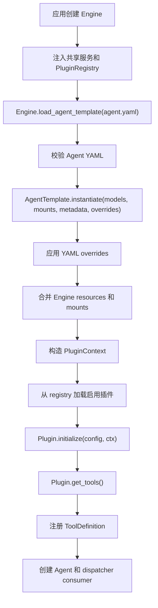
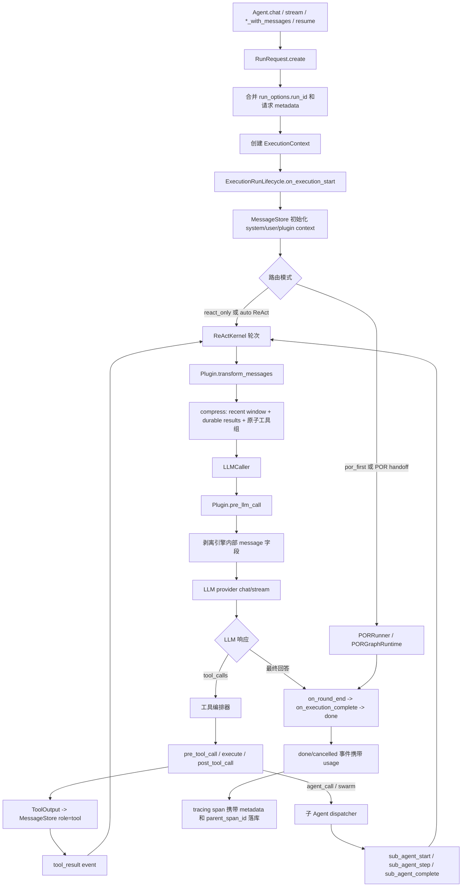

<h1 align="center">AxcAgentEngine</h1>

<p align="center">
  <b>带 POR 规划的 Agent 执行引擎 · 工具调用 · 插件体系</b>
</p>

<p align="center">
  
  
  
  
</p>

<p align="center">
  <a href="#-快速开始">快速开始</a> ·
  <a href="#-核心能力">核心能力</a> ·
  <a href="docs/ARCHITECTURE.md">架构</a> ·
  <a href="docs/PLUGIN_DEVELOPMENT.md">插件开发</a> ·
  <a href="examples/README.md">示例</a>
</p>

<p align="center">
  <a href="README.md">🇬🇧 English</a>
</p>

---

多数 Agent 框架靠 ReAct 循环跑：思考 → 调工具 → 观察 → 继续。任务复杂时容易发散。

AxcAgentEngine 在 ReAct 之外加了 **POR（Plan-Observe-Replan）**：先生成结构化计划，按依赖调度，观察结果，必要时重新规划。

## 🚀 快速开始

```bash
pip install axc-agent-engine

# 固定安装当前 2.3 版本
pip install axc-agent-engine==2.3.1

# 可选能力
pip install "axc-agent-engine[api]"
pip install "axc-agent-engine[workflow]"
pip install "axc-agent-engine[api,knowledge,workflow]"
```

需要 Python 3.11 或更高版本。

```python
from axc_agent_engine import AgentModels, Engine, LLMConfig, PluginRegistry
from axc_agent_engine.llm.client import OpenAIClient
from axc_agent_engine.plugins.builtin import BuiltinToolsPlugin

registry = PluginRegistry()
registry.register(BuiltinToolsPlugin)

engine = Engine(plugin_registry=registry)
models = AgentModels(default=OpenAIClient(LLMConfig(
    base_url="https://api.openai.com/v1",
    api_key="sk-xxx",
    model="gpt-4o",
)))
agent = engine.load_agent_template("./agents/my_agent.yaml").instantiate(models=models)

# 非流式
result = await agent.chat("Analyze last month's sales data")

# 流式
async for event in agent.stream("Build a REST API for user management"):
    if event.type == "stream_delta":
        print(event.content, end="")
    elif event.type == "tool_call":
        print(f"\n[Tool: {event.tool_name}]")
    elif event.type == "plan_created":
        print(f"\n[Plan: {event.content}, {len(event.steps)} steps]")
```


## ✨ 核心能力

- **POR 规划** —— 结构化计划 + 依赖调度 + 重新规划，支持 `auto` / `react_only` / `por_first` 路由
- **ReAct 执行器** —— 思考、工具调用、观察的标准循环
- **插件体系** —— 内置 spec 注册表，YAML 按需加载；可选能力都在插件里
- **工具协议** —— 所有工具返回 `ToolOutput`；只读并发，写串行；模型函数名安全映射
- **中断恢复** —— `WorkflowRuntime` + `CheckpointStore` + Agent resume API；Burr 通过 `axc-agent-engine[workflow]` 可选启用
- **OpenAI API 子集** —— Provider 协议 + OpenAI-compatible HTTP 客户端 / API 子集
- **记忆与知识** —— 四层记忆（KV、去重、衰减、图 hook）+ 插件自管混合检索
- **运行时绑定** —— 模型、挂载资源、请求 metadata、YAML overrides 分通道传入
- **MCP** —— stdio、JSON-RPC HTTP、官方 SDK transport
- **人工介入** —— 审批队列、`ask_human` 工具
- **Sidecar 套件** —— 多 Agent、仿真、评测、成本统计、失败挖掘、轨迹蒸馏

<details>
<summary>完整能力矩阵</summary>

| 能力 | 实现 |
| --- | --- |
| ReAct 循环 | `Executor` |
| POR 规划 | `auto` / `react_only` / `por_first` |
| 中断恢复 | 默认 `MemoryWorkflowRuntime`；安装 `axc-agent-engine[workflow]` 后可使用 `BurrWorkflowRuntime` |
| 插件系统 | spec 注册表 + YAML 按需加载 |
| LLM Provider | Provider 协议 + OpenAI-compatible HTTP |
| 并行工具 | 只读并发，写串行 |
| 工具输出 | 强制 `ToolOutput` |
| 工具名映射 | Provider 负责模型安全映射 |
| 上下文压缩 | 内置 `compress` 插件 |
| 记忆 | 四层 + KV 持久化 + 去重 + 衰减 |
| 知识库 | 插件自管检索，支持本地 sources 或挂载索引/资源 |
| MCP | stdio / JSON-RPC HTTP / 官方 SDK |
| 人工审批 | 审批队列 + `ask_human` |
| Sidecar | 多 Agent / 仿真 / 评测 / 成本 / 失败挖掘 / 蒸馏 |
| API 服务 | OpenAI Chat Completions 明确子集 |

</details>

## 📦 文档

| | |
| --- | --- |
| [架构](docs/ARCHITECTURE.md) | 引擎与插件边界 |
| [API](docs/API.md) | HTTP API 子集说明 |
| [插件开发](docs/PLUGIN_DEVELOPMENT.md) | 写自己的插件 |
| [安全模型](docs/SECURITY_MODEL.md) | 能力、风险、workspace |
| [示例](examples/README.md) | 7 个端到端 demo |
| [贡献](CONTRIBUTING.md) · [安全](SECURITY.md) · [LICENSE](LICENSE) | Apache-2.0 |

## Agent YAML

```yaml
name: "data-analyst"
description: "Data analysis assistant"

runtime:
  max_rounds: 50
  thinking: "auto"
  workspace: "/tmp/agent-workspace"
  allowed_capabilities:
    - "file_read"
    - "file_write"
    - "http_request"

system_prompt: |
  You are a data analysis assistant...

plugins:
  builtin_tools:
    enabled: true
    load: ["get_time", "file_read", "file_write", "http_request", "result_read"]
    defer: ["file_write", "http_request"]

  knowledge:
    enabled: true
    sources: ["./docs"]
    namespace: "default"

  memory:
    enabled: true
    namespace: "default"
    scope_keys: ["tenant_id", "user_id", "agent_name"]
    sensitive_policy: "redact"

  compress:
    enabled: true
    summary:
      after_rounds: 8
    durable_tools:
      names: ["agent_call", "knowledge_search"]
      keep: 12

  risk_guard:
    enabled: true
```

要点：

- 插件注册由宿主代码通过 `PluginRegistry` 显式完成；Agent YAML 只启用和配置已注册插件。
- `builtin_tools` 未配置 `load` 时只加载 `get_time`，其他内置工具必须显式启用。
- 带非空 capability 的工具默认拒绝，必须写入 `runtime.allowed_capabilities`。
- 文件和命令类工具默认要求配置 `runtime.workspace`。
- LLM 配置由代码提供，不写在 Agent YAML。
- 官方内置插件的 YAML 只配置行为参数。外部 endpoint、API key、client 对象、索引、store、catalog 都必须在代码里通过 `mounts` 注入。

## Provider 配置

`AgentModels` 接收模型 provider 对象。`OpenAIClient(LLMConfig(...))` 是内置的 OpenAI 兼容 provider；自定义 provider 需要实现 `LLMProvider` 协议（`model`、`tool_name_mapping`、`chat`、`stream`、`ask`、`close`）。

```python
from axc_agent_engine import AgentModels, ConcurrencyConfig, Engine, LLMConfig
from axc_agent_engine.llm.client import OpenAIClient
from axc_agent_engine.tools.name_mapping import ToolNameMappingConfig

main_model_config = LLMConfig(
    base_url="https://api.openai.com/v1",
    api_key="sk-xxx",
    model="gpt-4o",
    timeout=120,
    max_concurrent_requests=32,
    requests_per_minute=0,
    rate_limit_queue_timeout=10,
    tool_name_mapping=ToolNameMappingConfig(),
)

engine = Engine(
    concurrency=ConcurrencyConfig(
        max_engine_concurrent_runs=128,
        queue_timeout=30,
    ),
)
agent = engine.load_agent_template("./agents/my_agent.yaml").instantiate(
    models=AgentModels(default=OpenAIClient(main_model_config)),
)
```

工具名映射属于 provider 职责。内部工具名在 LLM 调用前编码为模型安全 function name，在 hooks/工具执行前解码回来。

## 运行时绑定

Agent YAML 描述稳定行为。运行时对象在模板实例化时由代码传入：

```python
agent = template.instantiate(
    models=AgentModels(
        default=gpt5_provider,
        utility=fast_provider,
        fallback=backup_provider,
    ),
    mounts={
        "knowledge.index": tenant_knowledge_index,
        "graph.store": tenant_graph_store,
        "skill.catalog": tenant_skill_catalog,
    },
    metadata={
        "tenant_id": "t_001",
    },
    overrides={
        "plugins.knowledge.namespace": "tenant:t_001",
        "plugins.skill.timeout": 30,
    },
)
```

- `models` 绑定这个 Agent 实例使用的模型 provider；Engine 不再持有模型配置。
- `mounts` 注入宿主持有的运行时资源；同名资源会覆盖 Engine 级资源。
- `metadata` 注入实例元数据；单次 chat/stream 请求的 metadata 仍可覆盖它。
- `overrides` 在插件初始化前 patch 并重新校验 Agent YAML 字段。它只接受 YAML 可序列化值，不能绑定运行时资源。

推荐使用的官方资源槽位是 `knowledge.index`、`graph.store`、`skill.catalog`、`tracing.exporter`。当前知识库插件也支持 `knowledge.documents`、`knowledge.embedding`、`knowledge.vector_store`、`knowledge.reranker` 等高级槽位，但它们仍然是运行时 mounts，不是 YAML 或 `overrides` 值。

## 请求 Metadata 与 Tracing

运行级 metadata 可以通过公开 Agent 入口传入，并进入 `ExecutionContext.state.metadata`。tracing 插件会把这些 metadata 安全复制到每个 span，同时保留 span 顶层的 `run_id`、`session_id`、`span_id`、`parent_span_id`。

```python
async for event in agent.stream_with_messages(
    messages,
    session_id="123",
    llm_options={"temperature": 0.2},
    run_options={"run_id": "run_abc"},
    metadata={
        "external_trace_id": "trace_1001",
        "conversation_id": 123,
        "agent_profile_id": 9,
    },
):
    ...
```

宿主应使用这个机制关联外部 trace 或审计记录。不要把外部关联 ID 塞进 prompt、tool args 或伪造 tool message。

## 取消与 Usage

每次运行都会通过 `run_options.run_id`、`metadata.run_id` 或引擎生成得到 `run_id`。宿主停止运行时应调用 Engine，让嵌套 `agent_call`、swarm、sidecar 内部 Agent run 和正在执行的工具共享同一个取消信号：

```python
engine.cancel_run("run_abc", reason="user_cancelled")
```

流式调用方会收到终态 `cancelled` 事件。非流式调用方会收到 `CancelledError`。终态 `done` 和 `cancelled` 事件都会在 `event.metadata["usage"]` 中携带聚合 usage：

```python
{
    "input_tokens": 1200,
    "output_tokens": 380,
    "total_tokens": 1580,
}
```

宿主应读取这个聚合值，不要从零散 LLM 事件或子 Agent 事件里自行累加。

## 多模态消息

上传、鉴权、OCR、图片识别、媒体 URL、base64 生成都属于宿主职责。引擎只接收标准化 message content parts，并通过 input/provider 边界传递：

```python
messages = [{
    "role": "user",
    "content": [
        {"type": "text", "text": "Explain this screenshot."},
        {"type": "image_url", "image_url": {"url": "https://example.com/screen.png"}},
        {"type": "image_base64", "media_type": "image/png", "data": "..."},
        {"type": "file_ref", "ref": "artifact:123", "metadata": {"name": "report.pdf"}},
    ],
}]
```

不支持的 part type 会直接失败。官方插件不访问宿主媒体服务，也不做部署相关的多模态预处理。

## ToolOutput 视图

`ToolOutput` 明确分离 LLM 上下文视图和 UI 展示视图：

- `context_view(max_chars=2000)` 写入 `MessageStore`，供下一轮 LLM 使用。它优先使用 `durable_summary`，其次 `summary`，最后才压缩 content，并保留 artifact refs。
- `display_view(max_chars=0)` 用于 `tool_result` 事件和宿主/UI 展示，可以暴露完整内容或 artifact refs，但不会污染 LLM 上下文。
- `compact_view()` 不是 UI 协议。新代码应显式调用 `context_view()` 或 `display_view()`。

宿主不要 monkey patch `ToolOutput` 来改变 LLM 上下文行为。

## 持久工具结果与子 Agent 事件

`compress` 插件会把 assistant `tool_calls` 和对应的 tool result 当作原子组保留。持久工具结果还会写入压缩边界，并在上下文打包后重新注入。默认 `agent_call` 和 `knowledge_search` 是持久工具；领域工具可以通过 `compress.durable_tools.names`、`compress.durable_tools.capabilities` 或 `ToolOutput.with_metadata({"durable": True, "durable_summary": "..."})` 标记。

`collaboration.agent_call` 会把子 Agent 活动转发到父运行事件流：

- `sub_agent_start`
- `sub_agent_step`
- `sub_agent_complete`

稳定字段包括 `parent_tool_call_id`、`sub_run_id`、`agent_name`、`agent_id`、`step.type`、`tool_call_id`、`tool_name`、`content`、`artifacts`、`error`、`duration_ms`。前端应直接渲染这些事件，不要解析 `agent_call` tool result 来伪造子 Agent 执行明细。

## API

HTTP API 是 OpenAI Chat Completions 明确子集。

- `POST /v1/chat/completions`
- `GET /v1/agents`
- `GET /v1/capabilities`

请求级 `tools` 和 `tool_choice` 刻意不支持。工具来自 Agent YAML 和插件，引擎统一执行 capability、风险元数据、插件 hooks、workspace policy 和审计事件。

客户端不应假设完整 OpenAI API 等价，请先调用 `/v1/capabilities` 做能力探测。详见 [docs/API.md](docs/API.md)。


## 内置插件

不运行基础 Agent 也不必存在的能力都属于插件。默认 `Engine.plugin_registry` 为空，内置和自定义插件都必须由宿主显式注册。

```python
from axc_agent_engine import AgentModels, Engine, PluginRegistry
from axc_agent_engine.plugins.builtin import BuiltinToolsPlugin, MemoryPlugin
from my_project.plugins import MyCustomPlugin

registry = PluginRegistry()
registry.register_many([BuiltinToolsPlugin, MemoryPlugin, MyCustomPlugin])
engine = Engine(plugin_registry=registry)
agent = engine.load_agent_template("./agents/my_agent.yaml").instantiate(models=AgentModels(default=llm))
```

| 插件 | 用途 |
| --- | --- |
| `builtin_tools` | 基础工具和 artifact 分页 |
| `knowledge` | ingestion、语义分块、混合检索、citation、rerank |
| `memory` | 记忆、治理工具、敏感信息策略、衰减、TTL |
| `output_format` | 最终输出契约、校验、修复、审计 |
| `graph` | 实体/关系图谱搜索和 CRUD |
| `skill` | 加载 skill，脚本通过 sandbox 执行 |
| `mcp` | MCP server 工具加载和治理 |
| `hooks` | 声明式 LLM/工具 hook 规则 |
| `compress` | 上下文窗口治理、摘要、召回、文件恢复 |
| `human_in_the_loop` | 人工审批和 `ask_human` |
| `risk_guard` | 动态工具风险分级 |
| `safety` | 输入清洗、prompt injection 检测、PII 脱敏 |
| `tracing` | trace/span 采集、审计模式、查询工具 |
| `reflexion` | 轮次结束和运行结束的自我反思 |
| `repetition_guard` | 重复工具调用/回复/结果检测 |
| `cost_statistics` | token 和工具调用次数统计 |
| `collaboration` | Agent 间调用和宿主编排薄入口 |
| `swarm` | 轻量并行 fan-out |

## Sidecar 旁路能力

旁路能力在 `axc_agent_engine.sidecar`，由宿主显式调用，不属于 Agent 核心执行链路。详见 [axc_agent_engine/sidecar/README.md](axc_agent_engine/sidecar/README.md)。

| 包 | 用途 |
| --- | --- |
| `sidecar.multi_agent` | 多 Agent 会话、调度器、停止条件、共享上下文 |
| `sidecar.simulation` | 结构化仿真内核 |
| `sidecar.eval` | 评测 case、标注 store、matcher、runner、report |
| `sidecar.agent_selector` | 宿主侧 Agent 路由和候选评分 |
| `sidecar.distiller` | 从轨迹蒸馏规则、工具偏好和 skill 候选 |
| `sidecar.failure_miner` | 聚类失败并建议修复/eval 覆盖 |
| `sidecar.cost_optimizer` | 成本估算和优化建议 |

会创建内部 Agent run 的 sidecar 入口支持标准运行上下文：

- `EvalRunner.run_cases(..., run_options, metadata, case_run_options, case_metadata)`
- `MultiAgentSession.run/stream(..., run_options, metadata, agent_run_options, agent_metadata)`
- `SimulationRunner.run/stream(..., run_options, metadata, actor_run_options, actor_metadata)`

factory metadata 会为每个 case、agent 或 actor 补充基础 metadata。`EvalCase.metadata` 仍然是评测/评分元数据，不是 request metadata。

## 运行流程

### 加载期



### 单次运行



## 插件开发

```python
from axc_agent_engine import BasePlugin, ToolDefinition, ToolOutput
from axc_agent_engine.plugins.config_schema import config_field, config_schema

class MyPlugin(BasePlugin):
    name = "my_plugin"
    display_name = "My Plugin"
    priority = 30
    phase = "core"
    config_schema = config_schema(
        "my_plugin",
        "我的插件",
        "配置示例。",
        [
            config_field(
                "api_url",
                "接口地址",
                "string",
				"插件调用的后端接口地址。",
				label_en="API URL",
				default="http://localhost:5000",
			),
		],
        display_name_en="My Plugin",
    )

    def initialize(self, config: dict, ctx) -> None:
        super().initialize(config, ctx)
        self.api_url = config["api_url"]

    def get_tools(self) -> list[ToolDefinition]:
        return [ToolDefinition(
            name="my_tool",
            description="Does something useful",
            parameters={"type": "object", "properties": {"query": {"type": "string"}}},
            execute=self._execute,
        )]

    async def pre_tool_call(self, exec_ctx, tool_name, arguments):
        return True, arguments

    async def _execute(self, args: dict, context: dict) -> ToolOutput:
        return ToolOutput.text(f"Result for {args['query']}")
```

插件必须继承 `BasePlugin`，必须声明 `config_schema`，工具必须返回 `ToolDefinition` 实例，`ToolRegistry` 不接受 dict。

宿主可以通过 `registry.list_plugin_config_schemas()` 或 `registry.get_plugin_config_schema("my_plugin")` 读取已注册插件 schema。schema 用于前端展示、模板生成、默认值展示和可选校验；YAML 中的额外 key 仍会传给 `initialize(config, ctx)`。

```yaml
plugins:
  my_plugin:
    enabled: true
    api_url: "http://localhost:5000"
```

## CLI

```bash
export AXC_LLM_BASE_URL="https://api.openai.com/v1"
export AXC_LLM_API_KEY="sk-xxx"
export AXC_LLM_MODEL="gpt-4o"

axc chat --agent ./agents/my_agent.yaml
axc serve --agent ./agents/my_agent.yaml --port 8000
axc --log-level DEBUG --json-logs chat --agent ./agents/my_agent.yaml
```

CLI 日志参数是全局参数，需要放在子命令前。

## 设计决策

- **Engine core = Executor + ReActKernel + LLMCaller。** 读取 Agent YAML，调用 LLM Provider，运行 ReAct 循环，输出事件和结果。
- **POR 状态转移交给 pydantic-graph。** `PORGraphRuntime` 负责 plan/step/observe/replan 循环；service 负责执行和 checkpoint。
- **Workflow resume 是运行时边界。** 默认使用 `MemoryWorkflowRuntime`；安装 workflow 可选依赖后可选择 `BurrWorkflowRuntime`。
- **插件是运行时扩展边界。** 知识库、记忆、图谱、MCP、输出修复、Skill 都属于插件。
- **推演是旁路。** 多 Agent session、simulation kernel、mode adapter 是宿主驱动 SDK 能力。
- **评测是旁路。** EvalRunner、EvalStore、AnnotationStore、AnnotationMatcher 和 report 是宿主驱动测试框架。
- **注册 ≠ 加载。** 内置 spec 注册表是完整插件表；Agent 只加载 YAML 中 enabled 的插件。
- **插件 schema 必须声明。** 没有 `config_schema` 的插件不能注册。
- **工具来自插件。** Engine 核心不内置业务工具。
- **工具必须返回 `ToolOutput`。** 非 `ToolOutput` 返回会被拒绝。
- **工具定义必须是 `ToolDefinition`。** 不接受 dict。
- **部署相关协议不进入开源引擎。** 外部 API、部署数据库、鉴权流程、服务发现属于宿主插件。
- **LLM 配置在代码中。** Agent YAML 只描述运行时限制、能力和插件。
- **致命错误不做兜底隐藏。** 配置错误、运行时资源错误、工具协议错误、流程错误都必须明确失败。
- **官方插件保持精简。** 可以强化 Agent 能力，但不持有宿主网络 client、部署 API key、外部服务或部署协议。
- **运行时资源走 mounts。** 不要通过 YAML 或 `overrides` 传资源对象。
- **请求关联走 metadata。** 宿主通过 `metadata` 传外部 trace 标识，tracing span 原样携带落库。
- **API 是明确子集。** 请求级 `tools`、`tool_choice`、`n > 1` 会被拒绝。

## 测试

```bash
python3 -m pytest -q
python3 -m pytest --cov --cov-report=term-missing:skip-covered -q
```

发布门禁要求总覆盖率不低于 95%。
